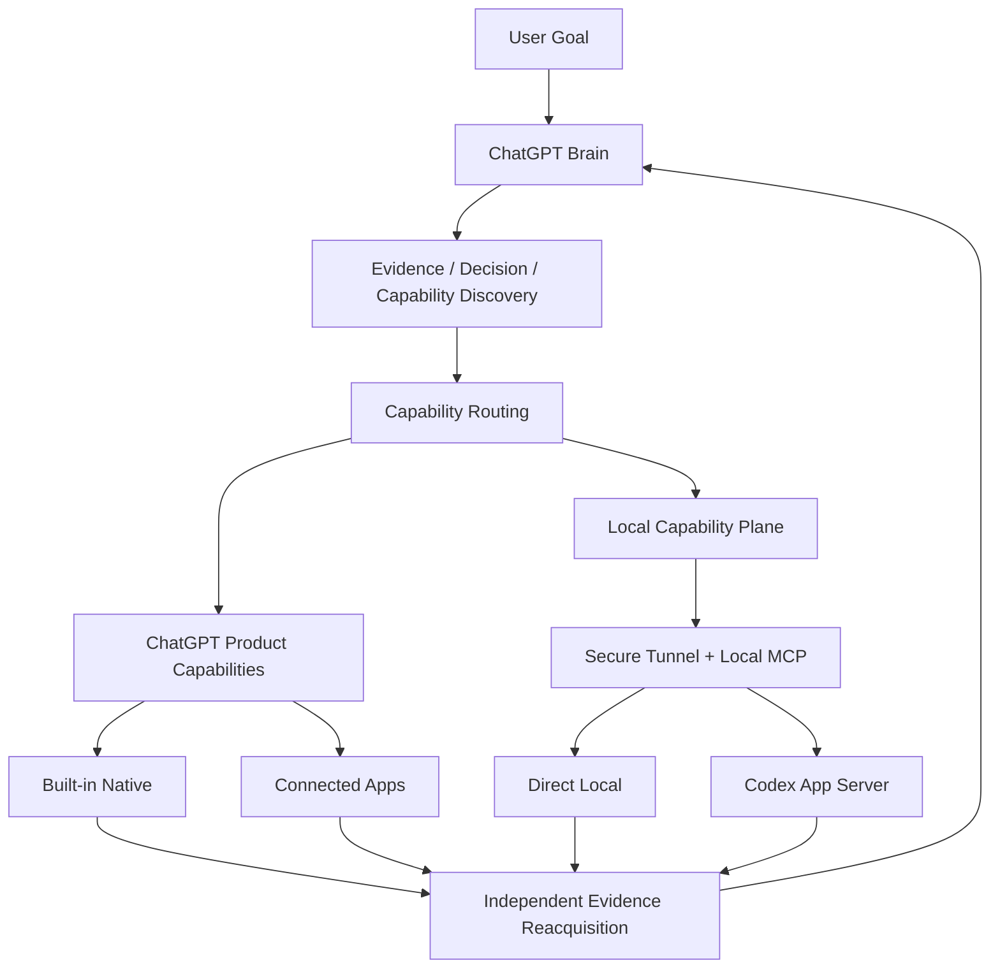

# chatgpt-codex-orchestrator

A **ChatGPT-centered Capability Orchestrator** with ChatGPT as the authoritative Brain. ChatGPT uses the current runtime's real capabilities to gather evidence, make decisions, select the best execution path, and reacquire authoritative evidence before deciding `ACCEPT / REVISE / DONE`.

**Core idea:** ChatGPT decides. Capabilities execute. ChatGPT verifies.

**Status:** v0.2 release line · repository operational default = **capability-first v0.2** · M8 release target `v0.2.0` · [简体中文](README.md)

> Whether `v0.2.0` has been formally published is determined by actual GitHub tag / Release readback. Versioned files on an M8 Phase A RC branch are not themselves a release.

## Why this project

ChatGPT can already handle a large range of research, file, data-analysis, and connected-app work. Codex is strong at sustained local coding execution. The real orchestration problem is therefore not simply "how to make ChatGPT call Codex," but:

- what capability the task actually requires;
- whether ChatGPT can already perform it directly;
- when a local workspace is needed;
- when Codex is the right executor;
- how to avoid making the user manually relay TASKs, RESULTs, workspace IDs, job IDs, and other intermediate state between agents;
- how to verify the real resource state after execution instead of treating an executor's self-report as truth;
- how to keep long-running work continuous across ChatGPT conversation replacement and local runtime restart instead of treating one chat transcript as system state.

`chatgpt-codex-orchestrator` reduces that into one control loop:

```text
Evidence first
→ Decision
→ Runtime Capability Discovery
→ Capability Routing
→ Execute
→ Independent Evidence Reacquisition
→ ACCEPT / REVISE / DONE
```

## Core capabilities

- **ChatGPT as authoritative Brain** — investigation, planning, decisions, routing, acceptance, and final `DONE` remain under ChatGPT control.
- **Runtime Capability Routing** — availability is determined by the current runtime, provider connection, resource authorization, and operation permission rather than static assumptions.
- **Native-first** — when Web, Files, Python/Data Analysis, Images, Artifacts, GitHub, or other connected apps are already sufficient, the task is not redundantly delegated to Codex.
- **Local Capability Plane** — Custom MCP App + Secure Tunnel + Local MCP add Local Machine / Local Workspace capability.
- **Direct Local** — for workspace read/search/status/diff, bounded edits, and focused verification.
- **Codex delegation** — for multi-file implementation, debugging, refactoring, shell-heavy work, and iterative tests/builds.
- **Evidence-first verification** — executor `RESULT` is an evidence candidate; the Brain reacquires GitHub, CI, Web, or local resource evidence before acceptance when possible.
- **Brain Continuity** — implemented and proven by formal restart/re-entry dogfood, so logical work, authority, and evidence do not depend on one conversation or one runtime process staying alive.
- **Zero human relay goal** — the user should not become the message bus between tools or agents.

## Architecture



In this model, **Executor does not mean Codex**. Codex is an important local coding executor, but it is not the default downstream for every task.

Claude, DeepSeek, or other agents may later be attached as specialists, advisors, or executors when real requirements justify them; the current project keeps ChatGPT as the sole authoritative Parent Brain.

## Current status

- Repository/default operational contract: **capability-first v0.2**
- M8 release target: `v0.2.0`; formal publication status must be read from GitHub tags/Releases, not inferred from a candidate branch's version field
- Alpha.3 legacy IAB Direct Brain Loop: feature-frozen, explicit compatibility/fallback only; capability failure never silently falls back to it
- M0–M7, Brain Continuity, Direct Local canonical-path hardening, bounded mission continuation, Stable Runtime activation, and the default-policy review are complete and accepted
- Issue #33 / PR #45: the operational default flip is accepted and materialized; it predates the formal v0.2 release
- Issue #46: M8 Phase A RC/release-readiness; Phase B merge/tag/GitHub Release remains gated by explicit project-level Parent authorization

See [`PROJECT_STATUS.md`](PROJECT_STATUS.md) for the current development state, [`ROADMAP.md`](ROADMAP.md) for the accepted high-level path, and [`docs/releases/v0.2.0.md`](docs/releases/v0.2.0.md) for the v0.2.0 release/operator contract.

## Quick Start

### Requirements

- Node.js `>= 22`
- Git
- Codex CLI when local Codex execution is required

### Install and test

```bash
git clone https://github.com/SIMON-WORLD/chatgpt-codex-orchestrator.git
cd chatgpt-codex-orchestrator
npm install
npm test
```

### Operational workflow

See [`skills/brain-command/SKILL.md`](skills/brain-command/SKILL.md) for current repository operational policy. [`SKILL.md`](SKILL.md) also records the v0.2 release line and Alpha.3 compatibility boundary.

### v0.2 local runtime

```bash
npm run start:v0.2
```

> v0.2 is the repository operational default contract. For Stable Runtime release upgrade/rollback, follow the exact-revision activation boundary in [`docs/releases/v0.2.0.md`](docs/releases/v0.2.0.md); do not hand-edit durable Governance JSON.

## Routing policy

The current normative capability / executor policy lives in [`CAPABILITY_ROUTING.md`](CAPABILITY_ROUTING.md).

The four top-level routes are:

- `CHATGPT_NATIVE`
- `CHATGPT_DIRECT_LOCAL`
- `CODEX_DELEGATE`
- `HYBRID`

Route, Capability, and Provider are separate concepts. Connecting GitHub, Gmail, Notion, Figma, or future apps should not require adding a new top-level route enum for every provider.

## Documentation

- [`PROJECT_STATUS.md`](PROJECT_STATUS.md) — current project state and fast recovery entrypoint
- [`ROADMAP.md`](ROADMAP.md) — accepted high-level path
- [`CAPABILITY_ROUTING.md`](CAPABILITY_ROUTING.md) — current routing / executor policy
- [`docs/architecture.md`](docs/architecture.md) — current technical architecture and operational-default / release compatibility boundary
- [`docs/rfc-v0.2-brain-continuity.md`](docs/rfc-v0.2-brain-continuity.md) — accepted, implemented, and real-dogfood-complete Brain Continuity contract
- [`docs/releases/v0.2.0.md`](docs/releases/v0.2.0.md) — v0.2.0 release notes, upgrade, Governance recovery, Stable Runtime rollback, and publication boundary
- [`docs/README.md`](docs/README.md) — documentation authority and historical RFC index
- [`CHANGELOG.md`](CHANGELOG.md) — release and unreleased change history
- [`CONTRIBUTING.md`](CONTRIBUTING.md) — contribution guide
- [`SKILL.md`](SKILL.md) — repository entry / Alpha.3 compatibility boundary

## License

[MIT License](LICENSE)
