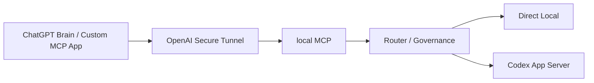
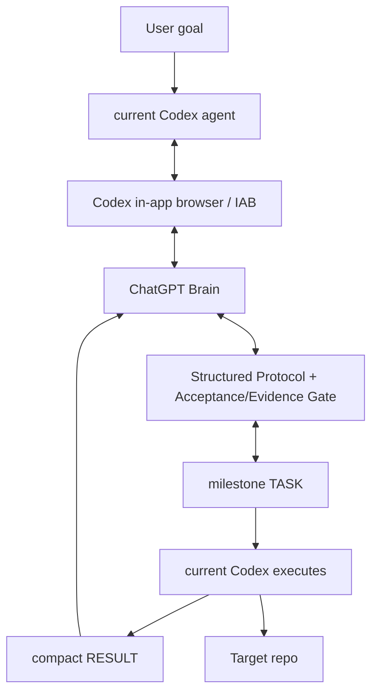

# chatgpt-codex-orchestrator

An agentic orchestration scheme that keeps **ChatGPT as the Brain (planner/reviewer)** and **the current Codex agent as the local executor** in one Direct Brain Loop.

**Status:** Alpha — `v0.1.0-alpha.3` · [简体中文](README.md) · **English**

---

## v0.2 candidate architecture (NOT the default) — M5/M6 status

> Separate from the current released `v0.1.0-alpha.3`. **v0.2 is not yet the CLI/Skill default**; the default remains the Alpha.3 IAB Direct Brain Loop (feature-frozen).

**Canonical v0.2 runtime path:**

```
ChatGPT (Custom MCP App)
→ OpenAI Secure Tunnel
→ local MCP
→ Router / Governance
→ Direct Local   or  Codex App Server
```



| v0.2 milestone | Status |
|---|---|
| M1–M4 App Server / local MCP / Router + Governance | landed |
| M5 Secure Tunnel + real ChatGPT / Codex App Server E2E | **completed** |
| M6 legacy IAB structural isolation (`src/legacy/`) | **completed** |
| M7 real-project dogfood + operational default flip | **pending / not started** |

- **IAB / Alpha.4 path is feature-frozen**: isolated under `src/legacy/`, **not deleted**.
- v0.2 runtime Node requirement matches `package.json`: **`Node.js >= 22`**.
- `src/index.js` is a **compatibility barrel**, not the v0.2 canonical runtime import root; canonical entries are `scripts/v0.2-start.mjs`, `src/transport/brain-local.js`, and `src/{mcp,router,governance,local,executor,state,transport}`.

## Why this project

Driving a coding task with ChatGPT as the planner and Codex as the executor is easy on the first turn, but hard to keep going. Conversations drift, executor context resets, process failures lose progress, and there is no clean contract between *what ChatGPT asked for* and *what Codex actually did*.

`chatgpt-codex-orchestrator` makes that loop controllable:

- One user goal, then **ChatGPT plans** and issues a `TASK`.
- **The current Codex agent executes locally** and returns a compact `RESULT` with evidence.
- **ChatGPT reviews** and replies `TASK` / `REVISE` / `ASK_USER` / `DONE`.
- The same ChatGPT conversation is reused throughout; if no unique composer is found it fails closed and never touches history.
- Secrets are redacted from persisted and logged context.

## How it works

The default path is the **Direct Brain Loop**.

- **ChatGPT** is the Brain (planner/reviewer): plans, issues tasks, reviews results, and decides when the work is done.
- **The current Codex agent** is the executor: it talks to one dedicated ChatGPT conversation through the Codex in-app browser (`iab`), executes each `TASK`, collects real evidence, and sends back a compact `RESULT`.
- **The same ChatGPT conversation** is reused throughout: `PLAN` → `TASK` → `RESULT` → `REVISE` / `TASK` / `DONE`.

After `DONE`, the publish gate (Brain = DONE, task completed, mandatory verification passed, no unrelated working-tree changes, publish identity preflight passed) allows a commit + fast-forward push.

You can also adopt an existing ChatGPT history conversation as the Brain: `$brain-command --conversation "<title>"` / `--conversation-url <url>` / `--adopt-current` (no new conversation is created).

**Legacy / experimental:** the detached worker / TaskService / nested-Codex runtime is retained as experimental and is no longer the default path (see `skills/brain-command/SKILL.md` and `docs/architecture.md`).

## Default execution contract

Established once per task; the Brain does not repeat these defaults inside every TASK (unless an exception/override is needed):

- ChatGPT owns `PLAN` / architecture / review / `DONE`.
- Codex stays within Brain-approved scope.
- Codex may run normal edit/debug/test iterations inside one milestone TASK.
- Mandatory verification applies.
- Protect secrets; fail closed on ambiguity.
- Return compact `RESULT` evidence.
- No force push or published-history rewrite.
- Publish only after `PUBLISH` + publication gate; `DONE` is terminal.

## Dogfood status (facts)

Alpha.3 Direct Brain Loop has completed a real long-running dogfood:

`agent-credentials-skill v0.3.0`
- existing ChatGPT conversation adopted;
- current Codex conversation retained;
- autonomous Brain ↔ Executor loop;
- 16 Brain TASKs in the pre-milestone-batching version;
- zero manual TASK/RESULT relay;
- commit / push / tag / GitHub Release completed;
- final Brain `DONE`.

Note: milestone-sized batching was added afterward and still needs validation across additional real projects. No performance improvement percentages are claimed until measured.

## Freeze policy / roadmap

Alpha.3 is the current frozen dogfood baseline.

For the next 3–5 real projects:
- no architecture changes unless there is a real blocker or repeated failure;
- collect operational metrics first.

Track: total duration, time to first Brain control, Brain TASK count, REVISE count, ASK_USER count, manual relay count, browser recovery/error count, conversation switches, publish retries, DONE success/failure.

Future ideas (not Alpha.3 requirements): native ChatGPT Desktop Brain transport if a supported interface becomes available; Claude / DeepSeek BrainProvider; long-running feature-branch checkpoint policy. Do not implement them now.

## Architecture (Alpha.3 IAB default path)

> The diagram above describes the Alpha.3 Direct Brain Loop default path; see the "v0.2 candidate architecture" section above for the v0.2 canonical path.



## Quick Start

### Prerequisites

- Node.js `>= 22`
- ESM project (`"type": "module"`)
- A Codex in-app browser (`iab`) runtime for a **real** ChatGPT-Brain run — see [SKILL.md](SKILL.md)

### Install and test

```bash
git clone https://github.com/SIMON-WORLD/chatgpt-codex-orchestrator.git
cd chatgpt-codex-orchestrator
npm install
npm test
```

### Library / entrypoints

- `npm run setup:brain-command` — one-time install of the launcher Skill to `$HOME/.agents/skills/brain-command/SKILL.md` and `$CODEX_HOME/brain-command/config.json`.
- `npm run status:brain-command` — read-only check of the launcher Skill and config.

## Core workflow and commands

These are the documented entry points (see [SKILL.md](SKILL.md) for runtime wiring).

| Command | Purpose | Status |
|---|---|---|
| `status:brain-command` | Read-only check: user-level launcher Skill discoverable + brain-command config exists/parses; prints `orchestratorRoot` / `dataRoot` / `workspaceRoot` and the defaults; never prints secrets; exit 0 healthy, 1 missing-or-invalid | Supported |
| `doctor` | Preflight checks (IAB runtime, ChatGPT login, codex CLI, git, state/log dirs, IPC, context provider) | Supported |
| `setup:brain-command` | One-time install of launcher Skill + config | Supported |

### Natural-language entry

```
用 ChatGPT 指挥模式完成这个任务：<goal>
```

## Supported in `v0.1.0-alpha.3`

- Direct Brain Loop: current Codex agent ↔ ChatGPT (via the in-app browser `iab`).
- ChatGPT Brain control loop: `PLAN` / `TASK` / `REVISE` / `ASK_USER` / `DONE`.
- Existing ChatGPT conversation adoption: by title / URL / explicit `--adopt-current`, capturing the real `/c/<id>`, without creating a new conversation.
- Composer safety: only the real composer (`#prompt-textarea` / composer-scoped) is targeted, failing closed (`ComposerUnavailableError`) and never touching history.
- Structured `acceptance[]` / `evidence[]` and a `DONE` acceptance gate (required acceptance must have real `pass` evidence).
- Milestone-sized Brain TASK governance (one comprehensive `PLAN`, prefers combining coherent executable/reviewable work).
- Compact `RESULT` protocol.
- Publish identity preflight (repo-local identity set before commit when an expected identity is configured) and publish gate (no force push / no rewrite of published history).
- Post-DONE boundary: after `DONE` the target repo must not receive non-Brain-reviewed product changes.
- Retained as experimental: detached worker / TaskService / nested-Codex runtime / durable recovery.

## Experimental

- `adopt-current` is implemented and retained, used only when the user explicitly asks (selected-tab identity is unstable across node-REPL invocations in the current IAB environment).
- Legacy detached worker / TaskService / TaskManager / durable recovery machinery is retained as experimental, not the default path.

## Limitations

- Direct Mode depends on the Codex in-app browser (`iab`); if `iab` is unavailable it fails clearly (`IABUnavailableError`) and does not fall back to an external browser (Edge/Chrome).
- Depends on the ChatGPT web DOM; composer/history selectors may need maintenance if the UI changes.
- Milestone batching still needs validation across more real projects; no performance improvement percentages are measured.

## Safety and durability

The current protections are structural, not guarantees:

- Composer locates only the real composer and fails closed when not found.
- Existing-conversation adoption creates no new conversation; the real `/c/<id>` is captured and bound.
- Acceptance/evidence gate before `DONE`.
- Bounded, secret-redacted context (no whole-repo dump).
- Publish identity preflight + no force push / no rewrite of published history.
- Post-DONE boundary: does not change the accepted target-repo outcome.

Do not interpret these as production-ready security guarantees — see [Limitations](#limitations).

## Documentation

- [CHANGELOG.md](CHANGELOG.md) — release-oriented history.
- [docs/development-history.md](docs/development-history.md) — detailed engineering / development notes.
- [docs/architecture.md](docs/architecture.md) — the current architecture reference.
- [CONTRIBUTING.md](CONTRIBUTING.md) — contribution guide.
- [SKILL.md](SKILL.md) — agent-facing runtime wiring and commands.

## License

Released under the [MIT License](LICENSE).
