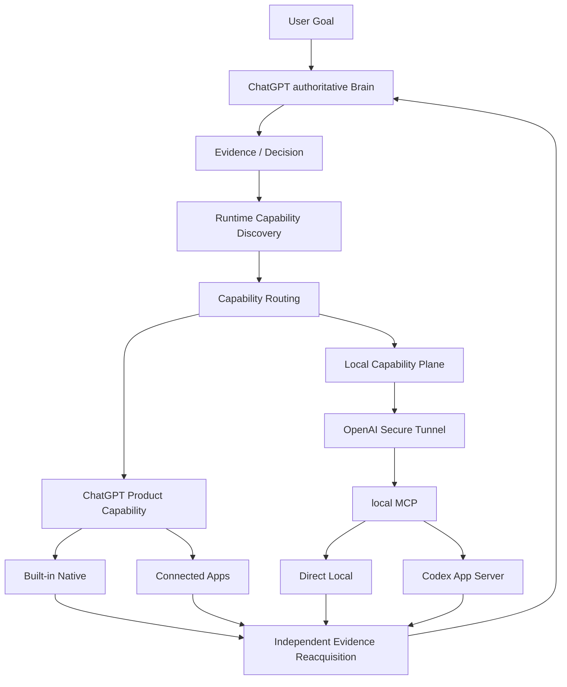
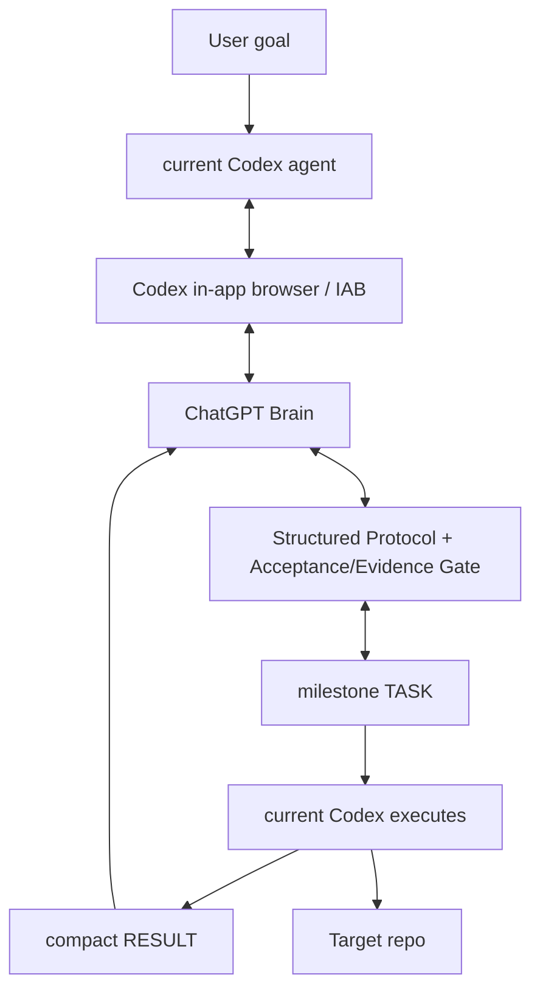

# chatgpt-codex-orchestrator

A Capability Orchestrator with **ChatGPT as the current authoritative Brain**: ChatGPT acquires first-party evidence, makes decisions, discovers which capabilities are actually available in the current runtime, selects the best execution path, and reacquires authoritative evidence before acceptance. **Codex is an important executor for sustained local coding work, not the default downstream for every task.**

**Status:** Alpha — `v0.1.0-alpha.3` · [简体中文](README.md) · **English**

---

## v0.2 candidate architecture (NOT the default) — N3 / M7 status

> Separate from the current released `v0.1.0-alpha.3`. **v0.2 is not yet the CLI/Skill default**; the default remains the Alpha.3 IAB Direct Brain Loop (feature-frozen).

The v0.2 operating model is:

```text
Evidence first
→ Decision
→ Runtime Capability Discovery
→ Capability Routing
→ Execute
→ Independent Evidence Reacquisition
→ ACCEPT / REVISE / DONE
```



- **ChatGPT Product Capability**: Web/Search, Files, Python/Data Analysis, Images, Artifacts, Tasks, plus connected apps such as GitHub, Gmail, Calendar, Notion, Figma, and future runtime-provided apps.
- **Local Capability Plane**: Custom MCP App + Secure Tunnel + Local MCP, used to add Local Machine / Local Workspace capability. It is not a mandatory transport for every task.
- **Codex**: the executor for multi-file coding, debugging, refactoring, shell-heavy / iterative tests, and other sustained local execution.
- **Future agents**: Claude, DeepSeek, or other agents may later be attached as specialists, advisors, or executors when real evidence justifies it; v0.2 does not implement multi-authority Brain governance.

| v0.2 stage | Status |
|---|---|
| M1–M4 App Server / local MCP / Router + Governance | **completed** |
| M5 Secure Tunnel + real ChatGPT / Codex App Server E2E | **completed** |
| M6 legacy IAB structural isolation (`src/legacy/`) | **completed** |
| N3 Capability-First Re-baseline | **active** |
| M7 real-project Capability Routing dogfood / hardening | **active** |
| M8 RC / Release | **pending** |

See [`PROJECT_STATUS.md`](PROJECT_STATUS.md) for the current phase baseline, [`ROADMAP.md`](ROADMAP.md) for the accepted high-level path, and [`CAPABILITY_ROUTING.md`](CAPABILITY_ROUTING.md) for the normative routing / executor policy.

- **IAB / Alpha.4 is feature-frozen**: isolated under `src/legacy/`, **not deleted**.
- v0.2 runtime Node requirement matches `package.json`: **`Node.js >= 22`**.
- `src/index.js` is a **compatibility barrel**, not the v0.2 canonical runtime import root. Canonical local-runtime entries are `scripts/v0.2-start.mjs`, `src/transport/brain-local.js`, and `src/{mcp,router,governance,local,executor,state,transport}`.

## Why this project

The original problem was simple: ChatGPT could plan and review while Codex could execute locally, but if the user had to manually relay `TASK`, `RESULT`, workspaceId, jobId, and other intermediate state between them, the user had become a human API/message bus. The project first set out to remove that relay.

v0.2 adds the next conclusion: **Executor does not mean Codex.** ChatGPT itself already has Web, GitHub, Files, Python, connected apps, and other capabilities. A mature orchestrator should therefore select the best capability for the current task instead of delegating everything to Codex.

Core principles:

- ChatGPT owns investigation, architecture, planning, routing, acceptance, and final `DONE`.
- Capabilities ChatGPT already has and is well suited to perform should not be redundantly delegated to Codex.
- Direct Local handles bounded local operations; Codex handles sustained local coding execution.
- Executor `RESULT` is an evidence candidate, not Brain truth.
- When possible, the Brain reacquires GitHub / Web / local authoritative evidence before `ACCEPT / REVISE / DONE`.
- The user does not manually relay workspaceId / jobId / taskId / stepId / RESULT between tools.

## How it works

### Current released Alpha.3 default

The current released `v0.1.0-alpha.3` default remains the **Direct Brain Loop**:

- **ChatGPT** is the Brain (planner/reviewer): it plans, issues tasks, reviews results, and decides when work is done.
- **The current Codex agent** is the executor: it talks to one dedicated ChatGPT conversation through the Codex in-app browser (`iab`), executes each `TASK`, collects real evidence, and sends back a compact `RESULT`.
- **The same ChatGPT conversation** is reused throughout: `PLAN` → `TASK` → `RESULT` → `REVISE` / `TASK` / `DONE`.

After `DONE`, the publish gate (Brain = DONE, task completed, mandatory verification passed, no unrelated working-tree changes, publish identity preflight passed) allows a commit + fast-forward push.

You can also adopt an existing ChatGPT history conversation as the Brain: `$brain-command --conversation "<title>"` / `--conversation-url <url>` / `--adopt-current` (no new conversation is created).

**Legacy / experimental:** the detached worker / TaskService / nested-Codex runtime is retained as experimental and is no longer the default path (see `skills/brain-command/SKILL.md` and `docs/architecture.md`).

## Default execution contract

Established once per task; the Brain does not repeat these defaults inside every TASK unless an exception is required:

- ChatGPT owns `PLAN` / architecture / review / `DONE`.
- Codex stays within Brain-approved scope.
- Codex may run normal edit/debug/test iterations inside one milestone TASK.
- Mandatory verification applies.
- Protect secrets; fail closed on ambiguity.
- Return compact `RESULT` evidence.
- No force push or published-history rewrite.
- Publish only after `PUBLISH` + publication gate; `DONE` is terminal.

## Dogfood status (facts)

### Alpha.3

Alpha.3 Direct Brain Loop completed a real long-running dogfood:

`agent-credentials-skill v0.3.0`
- existing ChatGPT conversation adopted;
- current Codex conversation retained;
- autonomous Brain ↔ Executor loop;
- 16 Brain TASKs in the pre-milestone-batching version;
- zero manual TASK/RESULT relay;
- commit / push / tag / GitHub Release completed;
- final Brain `DONE`.

### v0.2 M7

The first real-project nested `.git` dogfood proved that ChatGPT can autonomously route, invoke real Codex, manage intermediate IDs, and enter `REVISE` after failure without user relay. The product task did not complete because of Codex write-contract and mutation-reconciliation / cross-route-handoff gaps, so the run was truthfully recorded as a failure and moved into hardening rather than being declared `DONE`.

M7 now continues across three real execution patterns:

- **M7-A Native-only**: when ChatGPT Product Capability is sufficient, Codex calls = 0.
- **M7-B Codex-required**: real multi-file coding / tests through real Codex.
- **M7-C Hybrid**: ChatGPT investigates/decides → necessary local execution → ChatGPT reacquires GitHub/Web/local evidence for independent acceptance.

See [`PROJECT_STATUS.md`](PROJECT_STATUS.md) for the full current state.

## Freeze policy / roadmap

Alpha.3 remains the currently released/default dogfood baseline; v0.2 has not flipped the operational default.

The high-level roadmap records only accepted phases and does not pre-invent fixed v0.3/v0.4 implementation stages. See [`ROADMAP.md`](ROADMAP.md).

Possible future directions, not current commitments, include Claude / DeepSeek specialist/executor integration, generalized resource-scoped mutation leases, and multi-Brain authority research only if real evidence later proves it useful.

## Architecture (Alpha.3 IAB default path)

> The diagram below describes the released/default Alpha.3 Direct Brain Loop; see the v0.2 capability-first candidate architecture above for the current direction.



## Quick Start

### Prerequisites

- Node.js `>= 22`
- ESM project (`"type": "module"`)
- A Codex in-app browser (`iab`) runtime for a **current released Alpha.3** ChatGPT-Brain run — see [SKILL.md](SKILL.md)

### Install and test

```bash
git clone https://github.com/SIMON-WORLD/chatgpt-codex-orchestrator.git
cd chatgpt-codex-orchestrator
npm install
npm test
```

### Library / entrypoints

- `npm run setup:brain-command` — one-time install of the launcher Skill to `$HOME/.agents/skills/brain-command/SKILL.md` and `$CODEX_HOME/brain-command/config.json`.
- `npm run status:brain-command` — read-only check of the launcher Skill and config.
- `npm run start:v0.2` — start the v0.2 local capability runtime (candidate, not the released/default Skill entrypoint).

## Core workflow and commands

These are the documented entry points (see [SKILL.md](SKILL.md) for runtime wiring).

| Command | Purpose | Status |
|---|---|---|
| `status:brain-command` | Read-only check: user-level launcher Skill discoverable + brain-command config exists/parses; prints safe config fields and never prints secrets | Alpha.3 supported |
| `doctor` | Alpha.3 preflight checks (IAB runtime, ChatGPT login, codex CLI, git, state/log dirs, IPC, context provider) | Alpha.3 supported |
| `setup:brain-command` | One-time install of launcher Skill + config | Alpha.3 supported |
| `start:v0.2` | v0.2 Local MCP / production-style runtime | v0.2 candidate |

### Natural-language entry

```text
用 ChatGPT 指挥模式完成这个任务：<goal>
```

## Supported in `v0.1.0-alpha.3`

- Direct Brain Loop: current Codex agent ↔ ChatGPT (via the in-app browser `iab`).
- ChatGPT Brain control loop: `PLAN` / `TASK` / `REVISE` / `ASK_USER` / `DONE`.
- Existing ChatGPT conversation adoption: by title / URL / explicit `--adopt-current`, capturing the real `/c/<id>`, without creating a new conversation.
- Composer safety: only the real composer (`#prompt-textarea` / composer-scoped) is targeted, failing closed (`ComposerUnavailableError`) and never touching history.
- Structured `acceptance[]` / `evidence[]` and a `DONE` acceptance gate (required acceptance must have real `pass` evidence).
- Milestone-sized Brain TASK governance.
- Compact `RESULT` protocol.
- Publish identity preflight and publish gate (no force push / no rewrite of published history).
- Post-DONE boundary: after `DONE`, the target repo must not receive non-Brain-reviewed product changes.
- Retained as experimental: detached worker / TaskService / nested-Codex runtime / durable recovery.

## Experimental

- `adopt-current` is implemented and retained, used only when the user explicitly asks.
- Legacy detached worker / TaskService / TaskManager / durable recovery machinery is retained as experimental, not the default path.
- v0.2 capability-first runtime is not yet released or default-flipped.

## Limitations

- Released Alpha.3 Direct Mode depends on the Codex in-app browser (`iab`); if unavailable it fails clearly (`IABUnavailableError`) and does not fall back to an external browser.
- Alpha.3 depends on the ChatGPT web DOM and may need selector maintenance if the UI changes.
- v0.2 M7 remains in real-project dogfood / hardening and has not reached release/default-flip conditions.
- Capability availability depends on the current ChatGPT runtime, provider connection, target-resource authorization, and operation permission; a tool appearing in the surface does not prove a mutation is available.

## Safety and durability

The current protections are structural, not guarantees:

- Composer locates only the real composer and fails closed when not found.
- Existing-conversation adoption creates no new conversation; the real `/c/<id>` is captured and bound.
- Acceptance/evidence gate before `DONE`.
- Bounded, secret-redacted context (no whole-repo dump).
- Publish identity preflight + no force push / no rewrite of published history.
- Post-DONE boundary: does not change the accepted target-repo outcome.
- v0.2 local mutation keeps a single-writer / fail-closed reconciliation boundary; M7 is still hardening that lifecycle.

Do not interpret these as production-ready security guarantees — see [Limitations](#limitations).

## Documentation

- [PROJECT_STATUS.md](PROJECT_STATUS.md) — current project phase baseline.
- [ROADMAP.md](ROADMAP.md) — accepted high-level path.
- [CAPABILITY_ROUTING.md](CAPABILITY_ROUTING.md) — normative routing / executor policy.
- [CHANGELOG.md](CHANGELOG.md) — release-oriented history.
- [docs/development-history.md](docs/development-history.md) — detailed engineering / development notes.
- [docs/architecture.md](docs/architecture.md) — current architecture reference.
- [docs/rfc-v0.2-chatgpt-native-capability-inventory.md](docs/rfc-v0.2-chatgpt-native-capability-inventory.md) — v0.2 native capability research inventory.
- [docs/rfc-v0.2-capability-routing.md](docs/rfc-v0.2-capability-routing.md) — historical v0.2 routing design RFC; current normative policy is `CAPABILITY_ROUTING.md`.
- [CONTRIBUTING.md](CONTRIBUTING.md) — contribution guide.
- [SKILL.md](SKILL.md) — agent-facing wiring and commands for the released/default path.

## License

Released under the [MIT License](LICENSE).