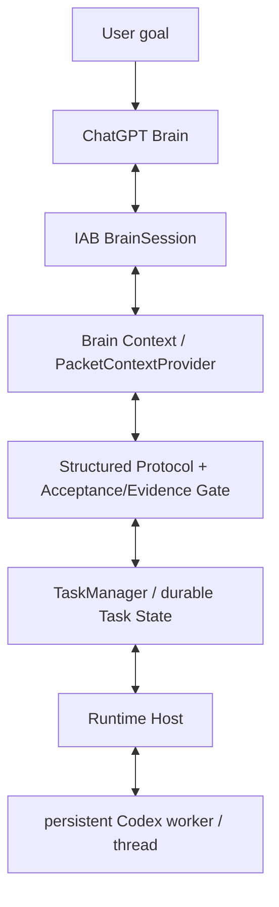

# chatgpt-codex-orchestrator

Agentic orchestration that keeps **ChatGPT as the planner/reviewer** and **Codex as the local executor** in one durable, recoverable loop.

**Status:** Alpha — `v0.1.0-alpha.2` · [简体中文](README.md) · **English**

---

## Why this project

Driving a coding task with ChatGPT as the planner and Codex as the executor is easy on the first turn, but hard to keep going. Conversations drift, executor context resets, process failures lose progress, and there is no clean contract between *what ChatGPT asked for* and *what Codex actually did*.

`chatgpt-codex-orchestrator` turns that loop into something durable:

- One user goal, then **ChatGPT plans** and issues a `TASK`.
- **Codex executes** locally and returns a structured result with evidence.
- **ChatGPT reviews** and replies `TASK` / `REVISE` / `ASK_USER` / `DONE`.
- Task state, a persistent Codex thread, and recovery/resume keep the loop consistent across turns and recoverable runtime failures.
- Secrets are redacted from persisted and logged context.

## How it works

The default path is the **Direct Brain Loop**.

- **ChatGPT** is the Brain (planner/reviewer): plans, issues tasks, reviews results, and decides when the work is done.
- **The current Codex agent** is the executor: it talks to one dedicated ChatGPT conversation through the Codex built-in browser, executes each `TASK`, collects real evidence, and sends back a compact `RESULT`.
- **The same ChatGPT conversation** is reused throughout: `PLAN` → `TASK` → `RESULT` → `REVISE` / `TASK` / `DONE`.

After `DONE`, the publish gate (Brain = DONE, task completed, mandatory verification passed, no unrelated working-tree changes) allows a commit + fast-forward push.

**Legacy / experimental:** the detached worker / TaskService / nested-Codex runtime is retained but is no longer the default path (see `skills/brain-command/SKILL.md` and `docs/architecture.md`).

## Architecture



## Quick Start

### Prerequisites

- Node.js `>= 18`
- ESM project (`"type": "module"`)
- A Codex in-app browser (IAB) runtime and a worker process for a **real** ChatGPT-Brain run — see [SKILL.md](SKILL.md)

### Install and test

```bash
git clone https://github.com/SIMON-WORLD/chatgpt-codex-orchestrator.git
cd chatgpt-codex-orchestrator
npm install
npm test
```

### Use the library

```js
import { TaskService } from './src/index.js';

// A runtime must be supplied for a live ChatGPT-Brain run.
// It provides the durable store, the brain-session openers, and the
// Codex executor used by the loop. See SKILL.md for the worker/brain
// wiring and the data-root resolver.
const service = new TaskService({ stateDir });

await service.startTask({
  goal,              // e.g. "Refactor the stats module and add tests"
  repoDir,           // absolute path to the target repository
  conversation: 'new',        // supported (default)
  // conversation: 'current', // EXPERIMENTAL
});
```

A real ChatGPT-Brain execution requires the in-app browser session plus a Codex worker running in an ordinary Node process (the node-REPL sandbox cannot spawn a descendant `codex`). The public API is library-oriented; this repository does **not** ship a polished global CLI.

## Core workflow and commands

These are the documented entry points (see [SKILL.md](SKILL.md) for the runtime wiring).

| Command | Purpose | Status |
|---|---|---|
| `doctor` | Preflight checks (IAB runtime, ChatGPT login, codex CLI, git, state/log dirs, IPC, context provider) | Supported |
| `start` | `TaskService.startTask({ goal, repoDir, conversation: 'new' })` | Supported |
| `resume` | Resume / turn-sliced `advanceTask` loop for a task | Supported |
| `status` | `TaskService.getTaskStatus(taskId)` | Supported |
| `status:brain-command` | Read-only check: user-level launcher Skill discoverable + brain-command config exists/parses; prints `orchestratorRoot` / `dataRoot` / `workspaceRoot` and the defaults; never prints secrets; exit 0 healthy, 1 missing-or-invalid | Supported |
| `cancel` | `TaskService.cancelTask(taskId)` | Supported |
| `adopt-current` | Continue in the *current* ChatGPT conversation | Experimental |

### Natural-language entry

```
用 ChatGPT 指挥模式完成这个任务：<goal>
```

## Alpha.2 — Delta Packets + Fast Bootstrap

- **One-time setup (user-runnable)** — run `npm run setup:brain-command` from the repository. It installs the launcher Skill to `$HOME/.agents/skills/brain-command/SKILL.md` and creates/updates `$CODEX_HOME/brain-command/config.json`, deterministically resolving `orchestratorRoot` (repo root), `dataRoot`, and `workspaceRoot` (pass `--orchestrator-root`, `--data-root`, `--workspace-root` to override). It runs once; normal task startup never reruns it.
- **`brain-command` launcher Skill** — the canonical user-facing entry. It resolves the user-scoped config at `$CODEX_HOME/brain-command/config.json`, resolves the repo deterministically, and runs a fast preflight (no broad filesystem discovery). One-time setup (`setupBrainCommand`) installs the launcher Skill to `$HOME/.agents/skills/brain-command/SKILL.md` and writes the config; normal execution never reinstalls it.
- **Read-only status check** — run `npm run status:brain-command` (scripts/brain-command-status.mjs → `brainCommandStatus`). It verifies the launcher Skill is discoverable at `$HOME/.agents/skills/brain-command/SKILL.md` (legacy `$CODEX_HOME/skills/...` is flagged as a warning), verifies `$CODEX_HOME/brain-command/config.json` exists and parses, then prints `orchestratorRoot`, `dataRoot`, `workspaceRoot`, `defaultBrain`, `defaultExecutor`, `defaultConversationMode`. It never prints secrets; exit code 0 = healthy, 1 = missing/invalid. Read-only and does not change orchestration semantics.
- **Delta packet protocol** — `PLAN` / `REPLAN` are Brain → Orchestrator control/state operations (never forwarded to Codex); normal `TASK` / `RESULT` are compact by default; legacy text protocol stays a compatible fallback.
- **Durable state (schema v1)** — `taskContract`, `plan`, `repoContext`, `verificationPolicy`, `stepSummaries`, `evidenceLedger`, `unresolvedRisks`, all hydrated at load time.
- **Tiered verification** — step / milestone / final, with authority precedence (mandatory orchestrator boundary > Brain requested level > Codex local minimum).
- **Orchestrator-owned compaction** — `reviewed -> compact` produces a durable `stepSummary`.
- **Escalation** — after 2 failed `REVISE` on the same step, the step packet can switch to the fuller contract packet.
- **Dogfood instrumentation** — light bootstrap/packet/verification metrics (not a cost ledger).

Scope boundaries: `adopt-current` stabilization, parallel executors, multiple Brain providers, Brain Council, MCP context provider, GUI, cost ledger, and remote runtime are NOT implemented in Alpha.2.

## Supported in `v0.1.0-alpha.2`

- `conversation: 'new'` — the default, supported path (new ChatGPT conversation + persistent Codex thread).
- ChatGPT Brain control loop: `TASK` / `REVISE` / `ASK_USER` / `DONE`.
- Structured `acceptance[]` and `evidence[]`, with an Acceptance Gate on `DONE` (a required acceptance must have real `pass` evidence, never inferred from the Codex exit code alone).
- Durable Task State (schema v1) with turn-sliced `advanceTask`.
- Persistent Codex worker/thread integration (the same thread is reused across turns).
- `resumeTask` / `recovery_required` — crash-safe continuation.
- Crash-safe `TaskLock` (owner pid + heartbeat; stale locks reclaimed).
- Brain Project Profile / project binding (`bindProject` / `getProjectBinding`).
- `PacketContextProvider` — bounded, secret-redacted repository context.
- `doctor` diagnostics and safe defaults (no dangerous bypass by default).

## Experimental

- `conversation: 'current'` / `adopt-current` — retained, but **not** a stability promise in this alpha. Selected-tab identity is unstable across node-REPL invocations in the current Codex Desktop / IAB environment.

## Limitations

- The Codex worker must run in an ordinary Node process; the node-REPL sandbox cannot spawn a descendant `codex`.
- The default `%LOCALAPPDATA%` data root may not be writable from the sandbox; callers may need a durable writable root via the resolver or `CHATGPT_ORCHESTRATOR_DATA_ROOT`.
- The local governor currently passes its bearer token on the Codex child argv. It is redacted from logs/state but not removed from the process argv.
- Depends on the ChatGPT web DOM; selectors/placeholders may need maintenance if the UI changes.
- No cross-process automatic recovery beyond `resumeTask`; no concurrent task queue; no cost ledger.

## Safety and durability

The current protections are structural, not guarantees:

- Durable Task State with atomic writes (and a `.bak` fallback).
- Crash-safe per-task lock with owner heartbeat.
- Acceptance/evidence gate before `DONE`.
- Bounded, secret-redacted context (no whole-repo dump).
- Recovery / resume that reuses the same conversation, tab, and Codex thread.

Do not interpret these as production-ready security guarantees — see [Limitations](#limitations).

## Roadmap

Planned, not promised:

- Stabilize `adopt-current` (identity binding via an explicit `tabId` instead of `tabs.selected()`).
- Cloudflare / remote runtime.
- Cost ledger.
- Richer context providers.
- GUI-free daily entry.

## Documentation

- [CHANGELOG.md](CHANGELOG.md) — release-oriented history.
- [docs/development-history.md](docs/development-history.md) — detailed engineering / development notes.
- [docs/architecture.md](docs/architecture.md) — the current architecture reference.
- [CONTRIBUTING.md](CONTRIBUTING.md) — contribution guide.
- [SKILL.md](SKILL.md) — agent-facing runtime wiring and commands.

## License

Released under the [MIT License](LICENSE).
