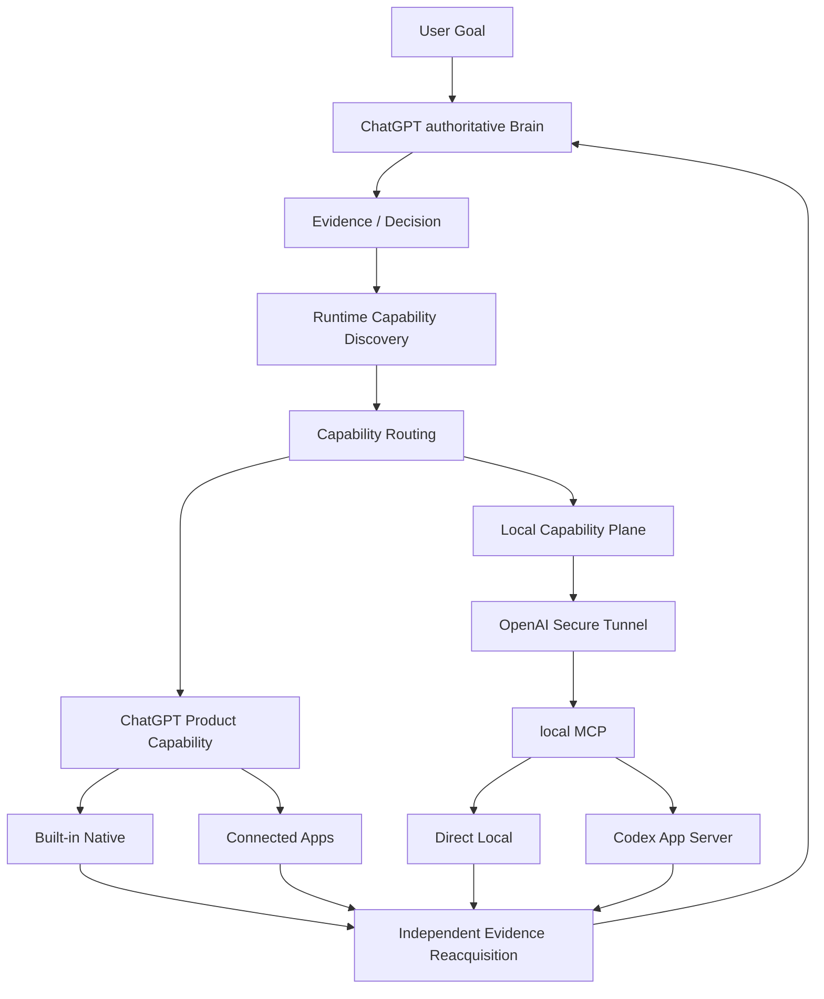
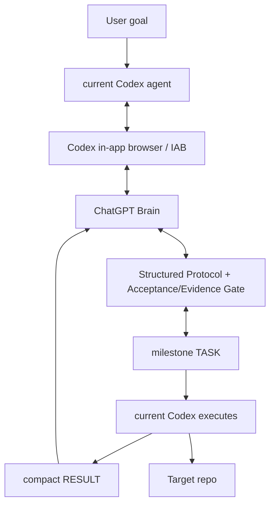

# chatgpt-codex-orchestrator

一个以 **ChatGPT 为当前 authoritative Brain** 的 Capability Orchestrator：让 ChatGPT 获取一手证据、做出决策、发现当前 runtime 实际可用能力、选择最合适的执行路径，并在执行后重新取得 authoritative evidence 完成验收。**Codex 是持续本地 coding execution 的重要 Executor，但不是默认下游。**

**状态：** Alpha — `v0.1.0-alpha.3` · **简体中文** · [English](README.en.md)

---

## v0.2 候选架构（非默认）— N3 / M7 状态

> 与当前 released `v0.1.0-alpha.3` 分离。**v0.2 还不是 CLI/Skill 的默认入口**；默认仍是 Alpha.3 的 IAB Direct Brain Loop（feature-frozen）。

v0.2 的 operating model 是：

```text
Evidence first
→ Decision
→ Runtime Capability Discovery
→ Capability Routing
→ Execute
→ Independent Evidence Reacquisition
→ ACCEPT / REVISE / DONE
```



- **ChatGPT Product Capability**：Web/Search、Files、Python/Data Analysis、Images、Artifacts、Tasks，以及 GitHub、Gmail、Calendar、Notion、Figma 等当前 runtime 已连接 App。
- **Local Capability Plane**：Custom MCP App + Secure Tunnel + Local MCP，用于补齐 Local Machine / Local Workspace capability；它不是所有任务的必经 transport。
- **Codex**：多文件 coding、debug、refactor、shell-heavy / iterative tests 等 sustained local execution 的 Executor。
- **Future agents**：未来可按真实需要接入 Claude、DeepSeek 或其他 Agent 作为 specialist / advisor / executor；v0.2 不实现 multi-authority Brain。

| v0.2 阶段 | 状态 |
|---|---|
| M1–M4 App Server / local MCP / Router + Governance | **已完成** |
| M5 Secure Tunnel + real ChatGPT / Codex App Server E2E | **已完成** |
| M6 legacy IAB 结构隔离（`src/legacy/`） | **已完成** |
| N3 Capability-First Re-baseline | **进行中** |
| M7 real-project Capability Routing dogfood / hardening | **进行中** |
| M8 RC / Release | **待定** |

当前项目状态见 [`PROJECT_STATUS.md`](PROJECT_STATUS.md)，已接受高层路径见 [`ROADMAP.md`](ROADMAP.md)，规范性 routing / executor policy 见 [`CAPABILITY_ROUTING.md`](CAPABILITY_ROUTING.md)。

- **IAB / Alpha.4 路径 feature-frozen**：已隔离到 `src/legacy/`，**未删除**。
- v0.2 运行期 Node 要求与 `package.json` 一致：**`Node.js >= 22`**。
- `src/index.js` 是 **compatibility barrel**，不是 v0.2 canonical runtime 的 import root；canonical local runtime 入口是 `scripts/v0.2-start.mjs`、`src/transport/brain-local.js` 及 `src/{mcp,router,governance,local,executor,state,transport}`。

## 为什么做这个项目

最初的问题是：ChatGPT 可以规划和评审，Codex 可以本地执行，但如果用户必须在二者之间手工复制 `TASK`、`RESULT`、workspaceId、jobId 等中间状态，用户本身就变成了“人肉 API”。项目首先解决这个闭环问题。

v0.2 进一步确认：**Executor 不等于 Codex。** ChatGPT Web/Chat 本身已经拥有 Web、GitHub、Files、Python、connected apps 等大量能力，因此成熟的 orchestrator 不应该把所有任务都委托 Codex，而应根据当前 runtime 的真实 capability 选择最合适的执行路径。

核心原则：

- ChatGPT 负责调查、架构、规划、路由、验收和最终 `DONE`。
- ChatGPT 已有且适合直接完成的 capability 不重复委托 Codex。
- Direct Local 处理 bounded local operations；Codex 处理 sustained local coding execution。
- Executor `RESULT` 是 evidence candidate，不等于 Brain truth。
- Brain 在有能力时重新获取 GitHub / Web / local authoritative evidence 后再 `ACCEPT / REVISE / DONE`。
- 用户不承担 workspaceId / jobId / taskId / stepId / RESULT 的人工消息中转。

## 它如何工作

### 当前 released Alpha.3 默认路径

当前正式 release `v0.1.0-alpha.3` 的默认仍是 **Direct Brain Loop**：

- **ChatGPT** 是 Brain（规划者与评审者）：规划、下发任务、评审结果，并决定何时完成。
- **当前 Codex agent** 是执行者：通过 Codex 内置浏览器（`iab`）与本项目专用的一条 ChatGPT 会话通信，执行每个 `TASK`，收集真实证据，并回传紧凑的 `RESULT`。
- **同一条 ChatGPT conversation** 全程复用：`PLAN` → `TASK` → `RESULT` → `REVISE` / `TASK` / `DONE`。

`DONE` 后经发布门禁（Brain=DONE、任务完成、强制验证通过、工作树无无关改动、发布身份预检通过）才 commit 并 fast-forward push。

也可接管已有 ChatGPT 历史会话作为 Brain：`$brain-command --conversation "<标题>"` / `--conversation-url <url>` / `--adopt-current`（不新建会话）。

**Legacy / experimental：** 分离的 worker / TaskService / 嵌套 Codex runtime 保留为实验性，不再是默认路径（见 `skills/brain-command/SKILL.md` 与 `docs/architecture.md`）。

## 默认执行契约

每个任务只确立一次，Brain 无需在每个 TASK 内重复这些默认规则（除非需要异常/覆盖）：

- ChatGPT 拥有 `PLAN` / 架构 / 评审 / `DONE`。
- Codex 保持在 Brain 批准的范围内。
- Codex 可在单个里程碑 TASK 内进行常规的编辑/调试/测试迭代。
- 强制验证适用。
- 保护密钥，遇到歧义时 fail closed。
- 返回紧凑的 `RESULT` 证据。
- 不 force-push、不改写已发布历史。
- 仅在 `PUBLISH` + 发布门禁通过后发布；`DONE` 为终态。

## Dogfood 状态（事实）

### Alpha.3

Alpha.3 Direct Brain Loop 已用真实长期 dogfood 完成：

`agent-credentials-skill v0.3.0`
- 接管已有 ChatGPT 历史会话；
- 保留当前 Codex 会话；
- 自主 Brain ↔ Executor 闭环；
- 在 milestone 分批前版本中完成 16 个 Brain TASK；
- 零手动 TASK/RESULT 转接；
- 完成 commit / push / tag / GitHub Release；
- 最终 Brain `DONE`。

### v0.2 M7

第一次 real-project nested `.git` dogfood 已证明：ChatGPT 可以自主 route、调用真实 Codex、管理中间 ID、在失败后进入 `REVISE`，且不需要用户人工中转；但产品任务因 Codex write contract 与 mutation reconciliation / cross-route handoff 缺口未完成，因此结果被真实记录为 failure，并进入 hardening，而不是伪造 `DONE`。

M7 现在按三类真实任务继续：

- **M7-A Native-only**：ChatGPT Product Capability 足够时，Codex calls = 0。
- **M7-B Codex-required**：真实多文件 coding / tests，使用 real Codex。
- **M7-C Hybrid**：ChatGPT 调查/定案 → 必要 local execution → ChatGPT 重新获取 GitHub/Web/local evidence 独立验收。

完整状态见 [`PROJECT_STATUS.md`](PROJECT_STATUS.md)。

## 冻结策略与路线图

Alpha.3 仍是当前 released/default dogfood 基线；v0.2 尚未 default flip。

当前高层路线只记录已接受阶段，不提前发明 v0.3/v0.4 的固定实现计划。见 [`ROADMAP.md`](ROADMAP.md)。

未来方向（非当前承诺）可以包括 Claude / DeepSeek specialist/executor integration、generalized resource-scoped mutation lease、以及在真实 evidence 证明必要后研究 multi-Brain authority；这些不会在缺少真实需求时提前实现。

## 架构（Alpha.3 IAB 默认路径）

> 下图描述 Alpha.3 的 released/default Direct Brain Loop；v0.2 capability-first candidate 见上文。



## 快速开始

### 前置条件

- Node.js `>= 22`
- ESM 项目（`"type": "module"`）
- 一次**当前 released Alpha.3** 的真实 ChatGPT-Brain 运行需要 Codex 内置浏览器（`iab`）运行时——见 [SKILL.md](SKILL.md)

### 安装与测试

```bash
git clone https://github.com/SIMON-WORLD/chatgpt-codex-orchestrator.git
cd chatgpt-codex-orchestrator
npm install
npm test
```

### 使用库 / 入口

- `npm run setup:brain-command` — 一次性安装 launcher Skill 到 `$HOME/.agents/skills/brain-command/SKILL.md` 并写入 `$CODEX_HOME/brain-command/config.json`。
- `npm run status:brain-command` — 只读检查 launcher Skill 与 config。
- `npm run start:v0.2` — 启动 v0.2 local capability runtime（candidate，不是 released/default Skill 入口）。

## 核心工作流与命令

这些是文档化的入口（运行时接线见 [SKILL.md](SKILL.md)）。

| 命令 | 用途 | 状态 |
|---|---|---|
| `status:brain-command` | 只读检查：用户级 launcher Skill 可发现 + brain-command config 存在/可解析；打印 `orchestratorRoot` / `dataRoot` / `workspaceRoot` 与默认值；不打印 secret；退出 0 健康，1 缺失/无效 | Alpha.3 支持 |
| `doctor` | Alpha.3 预检（IAB 运行时、ChatGPT 登录、codex CLI、git、状态/日志目录、IPC、context provider） | Alpha.3 支持 |
| `setup:brain-command` | 一次性安装 launcher Skill 与配置 | Alpha.3 支持 |
| `start:v0.2` | v0.2 Local MCP / production-style runtime | v0.2 candidate |

### 自然语言入口

```text
用 ChatGPT 指挥模式完成这个任务：<goal>
```

## 在 `v0.1.0-alpha.3` 中支持

- Direct Brain Loop：当前 Codex agent ↔ ChatGPT（通过内置浏览器 `iab`）。
- ChatGPT Brain 控制闭环：`PLAN` / `TASK` / `REVISE` / `ASK_USER` / `DONE`。
- 已有 ChatGPT 会话接管：按标题 / URL / 显式 `--adopt-current`，捕获真实 `/c/<id>`，不新建会话。
- composer 安全：只定位真实 composer（`#prompt-textarea` / composer 作用域），失败即 fail closed（`ComposerUnavailableError`），不触碰历史消息。
- 结构化 `acceptance[]` / `evidence[]` 与 `DONE` 验收门禁（必需验收项必须有真实 `pass` 证据）。
- milestone 大小的 Brain TASK 治理（一次综合 `PLAN`，倾向合并可执行/可评审的工作）。
- 紧凑 `RESULT` 协议。
- 发布身份预检（若配置了 expected identity，提交前设置 repo-local identity）与发布门禁（不 force-push / 不改写已发布历史）。
- Post-DONE 边界：`DONE` 后目标仓库不得出现未经 Brain 评审的新产品改动。
- 保留为实验性：分离的 worker / TaskService / 嵌套 Codex runtime / 持久 recovery。

## 实验性

- `adopt-current` 已实现并保留，仅在用户明确要求时使用（当前 IAB 环境所选 tab 身份在多次 REPL 调用间不稳定）。
- Legacy detached worker / TaskService / TaskManager / durable recovery machinery 保留为实验性，不是默认路径。
- v0.2 capability-first runtime 尚未 release/default flip。

## 限制

- Released Alpha.3 Direct Mode 依赖 Codex 内置浏览器（`iab`）；若 `iab` 不可用会明确失败（`IABUnavailableError`），不回退到外部浏览器（Edge/Chrome）。
- Alpha.3 依赖 ChatGPT Web DOM；selector 变化可能需要维护。
- v0.2 M7 仍处于 real-project dogfood / hardening；尚未达到 release/default flip 条件。
- Capability availability 依赖当前 ChatGPT runtime、连接的 provider、目标 resource authorization 和 operation permission；工具出现在 surface 中不等于对应 mutation 一定可执行。

## 安全与可靠性

当前这些保护属于结构性实现，而非保证：

- composer 只定位真实 composer，找不到则 fail closed。
- 已有 conversation 接管不新建会话；真实 `/c/<id>` 被捕获并绑定。
- `DONE` 之前的验收/证据门禁。
- 有界、脱敏的上下文（不做整个仓库的转储）。
- 发布身份预检 + 不 force-push / 不改写已发布历史。
- Post-DONE 边界：不改变已验收的 target repo outcome。
- v0.2 local mutation 保持 single-writer / fail-closed reconciliation 边界；当前 M7 仍在继续 hardening。

不要把这些理解为生产就绪的安全保证——见 [限制](#限制)。

## 文档

- [PROJECT_STATUS.md](PROJECT_STATUS.md) —— 当前项目阶段状态基线。
- [ROADMAP.md](ROADMAP.md) —— 已接受的高层路线。
- [CAPABILITY_ROUTING.md](CAPABILITY_ROUTING.md) —— 当前规范性 routing / executor policy。
- [CHANGELOG.md](CHANGELOG.md) —— 面向发布的版本历史。
- [docs/development-history.md](docs/development-history.md) —— 详细工程/开发笔记。
- [docs/architecture.md](docs/architecture.md) —— 当前架构参考。
- [docs/rfc-v0.2-chatgpt-native-capability-inventory.md](docs/rfc-v0.2-chatgpt-native-capability-inventory.md) —— v0.2 native capability research inventory。
- [docs/rfc-v0.2-capability-routing.md](docs/rfc-v0.2-capability-routing.md) —— v0.2 historical routing design RFC；当前 normative policy 见 `CAPABILITY_ROUTING.md`。
- [CONTRIBUTING.md](CONTRIBUTING.md) —— 贡献指南。
- [SKILL.md](SKILL.md) —— agent 面向的 released/default 运行时接线与命令。

## 许可协议

在 [MIT License](LICENSE) 下发布。