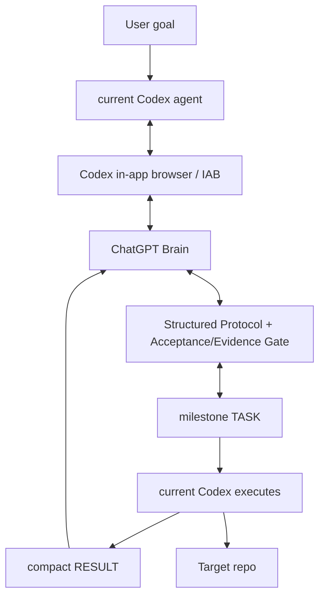

# chatgpt-codex-orchestrator

一种 Agent 编排方案，让 **ChatGPT 作为 Brain（规划/评审）**、**当前 Codex agent 作为本地执行方**，在一条 Direct Brain Loop 上协同完成编码任务。

**状态：** Alpha — `v0.1.0-alpha.3` · **简体中文** · [English](README.en.md)

---

## 为什么做这个项目

用 ChatGPT 做规划、用 Codex 做执行来驱动一个编码任务，第一次很容易，但要持续下去却很难：对话会漂移、执行上下文会重置、进程失败会丢失进度，而且“ChatGPT 要什么”和“Codex 实际做了什么”之间缺乏清晰的契约。

`chatgpt-codex-orchestrator` 让这条闭环变得可控：

- 一个用户目标，然后由 **ChatGPT 规划**并下发 `TASK`。
- **当前 Codex agent 本地执行**并返回带证据的紧凑 `RESULT`。
- **ChatGPT 评审**并回复 `TASK` / `REVISE` / `ASK_USER` / `DONE`。
- 全程复用同一条 ChatGPT conversation；找不到唯一 composer 时 fail closed，不修改历史消息。
- 密钥会从持久化与日志化上下文中被脱敏。

## 它如何工作

默认路径是 **Direct Brain Loop**。

- **ChatGPT** 是 Brain（规划者与评审者）：规划、下发任务、评审结果，并决定何时完成。
- **当前 Codex agent** 是执行者：通过 Codex 内置浏览器（`iab`）与本项目专用的一条 ChatGPT 会话通信，执行每个 `TASK`，收集真实证据，并回传紧凑的 `RESULT`。
- **同一条 ChatGPT conversation** 全程复用：`PLAN` → `TASK` → `RESULT` → `REVISE` / `TASK` / `DONE`。

`DONE` 后经发布门禁（Brain=DONE、任务完成、强制验证通过、工作树无无关改动、发布身份预检通过）才 commit 并 fast-forward push。

也可接管已有 ChatGPT 历史会话作为 Brain：`$brain-command --conversation "<标题>"` / `--conversation-url <url>` / `--adopt-current`（不新建会话）。

**Legacy / experimental：** 分离的 worker / TaskService / 嵌套 Codex runtime 保留为实验性，不再是默认路径（见 `skills/brain-command/SKILL.md` 与 `docs/architecture.md`）。

## 默认执行契约

每个任务只确立一次，Brain 无需在每个 TASK 内重复这些默认规则（除非需要异常/覆盖）：

- ChatGPT 拥有 `PLAN` / 架构 / 评审 / `DONE`。
- Codex 保持在 Brain 批准的范围内。
- Codex 可在单个里程碑 TASK 内进行常规的编辑/调试/测试迭代。
- 强制验证适用。
- 保护密钥，遇到歧义时 fail closed。
- 返回紧凑的 `RESULT` 证据。
- 不 force-push、不改写已发布历史。
- 仅在 `DONE` + 发布门禁通过后发布。

## Dogfood 状态（事实）

Alpha.3 Direct Brain Loop 已用真实长期 dogfood 完成：

`agent-credentials-skill v0.3.0`
- 接管已有 ChatGPT 历史会话；
- 保留当前 Codex 会话；
- 自主 Brain ↔ Executor 闭环；
- 在 milestone 分批前版本中完成 16 个 Brain TASK；
- 零手动 TASK/RESULT 转接；
- 完成 commit / push / tag / GitHub Release；
- 最终 Brain `DONE`。

说明：milestone 分批是在之后加入的，仍需在更多真实项目上验证。未测量前不宣称性能提升百分比。

## 冻结策略与路线图

Alpha.3 是当前冻结的 dogfood 基线。

未来 3–5 个真实项目：
- 除非出现真实阻塞或重复失败，不做架构变更；
- 先收集运行指标。

跟踪指标：总耗时、到首个 Brain 控制的时间、Brain TASK 数、`REVISE` 数、`ASK_USER` 数、手动转接数、浏览器恢复/错误数、conversation 切换数、发布重试数、`DONE` 成功/失败。

未来方向（非 Alpha.3 要求）：原生 ChatGPT Desktop Brain transport（若出现受支持接口）、Claude / DeepSeek BrainProvider、长运行 feature-branch checkpoint 策略。这些现在不实现。

## 架构



## 快速开始

### 前置条件

- Node.js `>= 18`
- ESM 项目（`"type": "module"`）
- 一次**真实**的 ChatGPT-Brain 运行需要 Codex 内置浏览器（`iab`）运行时——见 [SKILL.md](SKILL.md)

### 安装与测试

```bash
git clone https://github.com/SIMON-WORLD/chatgpt-codex-orchestrator.git
cd chatgpt-codex-orchestrator
npm install
npm test
```

### 使用库 / 入口

- `npm run setup:brain-command` — 一次性安装 launcher Skill 到 `$HOME/.agents/skills/brain-command/SKILL.md` 并写入 `$CODEX_HOME/brain-command/config.json`。
- `npm run status:brain-command` — 只读检查 launcher Skill 与 config。

## 核心工作流与命令

这些是文档化的入口（运行时接线见 [SKILL.md](SKILL.md)）。

| 命令 | 用途 | 状态 |
|---|---|---|
| `status:brain-command` | 只读检查：用户级 launcher Skill 可发现 + brain-command config 存在/可解析；打印 `orchestratorRoot` / `dataRoot` / `workspaceRoot` 与默认值；不打印 secret；退出 0 健康，1 缺失/无效 | 支持 |
| `doctor` | 预检（IAB 运行时、ChatGPT 登录、codex CLI、git、状态/日志目录、IPC、context provider） | 支持 |
| `setup:brain-command` | 一次性安装 launcher Skill 与配置 | 支持 |

### 自然语言入口

```
用 ChatGPT 指挥模式完成这个任务：<goal>
```

## 在 `v0.1.0-alpha.3` 中支持

- Direct Brain Loop：当前 Codex agent ↔ ChatGPT（通过内置浏览器 `iab`）。
- ChatGPT Brain 控制闭环：`PLAN` / `TASK` / `REVISE` / `ASK_USER` / `DONE`。
- 已有 ChatGPT 会话接管：按标题 / URL / 显式 `--adopt-current`，捕获真实 `/c/<id>`，不新建会话。
- composer 安全：只定位真实 composer（`#prompt-textarea` / composer 作用域），失败即 fail closed（`ComposerUnavailableError`），不触碰历史消息。
- 结构化 `acceptance[]` / `evidence[]` 与 `DONE` 验收门禁（必需验收项必须有真实 `pass` 证据）。
- milestone 大小的 Brain TASK 治理（一次综合 `PLAN`，倾向合并可执行/可评审的工作）。
- 紧凑 `RESULT` 协议。
- 发布身份预检（若配置了 expected identity，提交前设置 repo-local identity）与发布门禁（不 force-push / 不改写已发布历史）。
- Post-DONE 边界：`DONE` 后目标仓库不得出现未经 Brain 评审的新产品改动。
- 保留为实验性：分离的 worker / TaskService / 嵌套 Codex runtime / 持久 recovery。

## 实验性

- `adopt-current` 已实现并保留，仅在用户明确要求时使用（当前 IAB 环境所选 tab 身份在多次 REPL 调用间不稳定）。
- Legacy detached worker / TaskService / TaskManager / durable recovery machinery 保留为实验性，不是默认路径。

## 限制

- Direct Mode 依赖 Codex 内置浏览器（`iab`）；若 `iab` 不可用会明确失败（`IABUnavailableError`），不回退到外部浏览器（Edge/Chrome）。
- 依赖 ChatGPT Web DOM；若 UI 变化，composer/历史选择器可能需要维护。
- milestone 分批仍需更多真实项目验证；性能提升百分比未测量。

## 安全与可靠性

当前这些保护属于结构性实现，而非保证：

- composer 只定位真实 composer，找不到则 fail closed。
- 已有 conversation 接管不新建会话；真实 `/c/<id>` 被捕获并绑定。
- `DONE` 之前的验收/证据门禁。
- 有界、脱敏的上下文（不做整个仓库的转储）。
- 发布身份预检 + 不 force-push / 不改写已发布历史。
- Post-DONE 边界：不改变已验收的 target repo outcome。

不要把这些理解为生产就绪的安全保证——见 [限制](#限制)。

## 文档

- [CHANGELOG.md](CHANGELOG.md) —— 面向发布的版本历史。
- [docs/development-history.md](docs/development-history.md) —— 详细工程/开发笔记。
- [docs/architecture.md](docs/architecture.md) —— 当前架构参考。
- [CONTRIBUTING.md](CONTRIBUTING.md) —— 贡献指南。
- [SKILL.md](SKILL.md) —— agent 面向的运行时接线与命令。

## 许可协议

在 [MIT License](LICENSE) 下发布。
