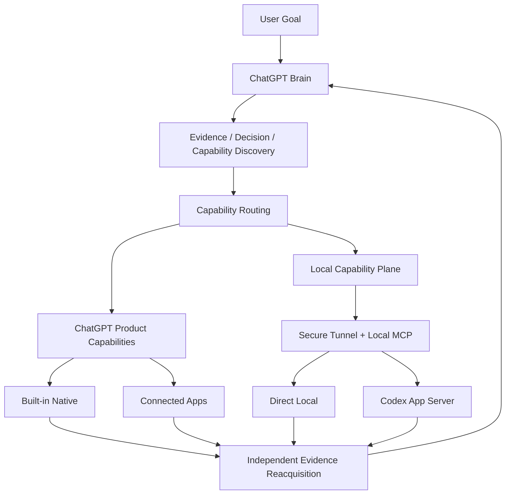

# chatgpt-codex-orchestrator

一个以 **ChatGPT 为 authoritative Brain** 的 Capability Orchestrator。它让 ChatGPT 根据任务目标和当前 runtime 实际可用能力，自主获取证据、做出决策、选择最合适的执行路径，并在执行后重新获取权威证据再决定 `ACCEPT / REVISE / DONE`。

**核心原则：** ChatGPT decides. Capabilities execute. ChatGPT verifies.

**状态：** formal release = **v0.2.0** · repository operational default = **capability-first v0.2** · M8 / Issue #46 = **CLOSED / DONE** · [English](README.en.md)

> GitHub tag / Release readback 是正式 publication truth。M8 / Issue #46 已完成并保留为历史 release-control evidence，不是当前 live gate 或 release authority。

## 为什么做这个项目

ChatGPT 已经可以完成大量研究、文件/数据、媒体/产物以及 connected plugin/app 工作；Codex 则擅长持续的本地 coding execution。具体产品 capability 不在本仓库维护静态全局清单，而由当前 runtime 的真实 tool/action/provider/resource/operation surface 决定。真正的问题不是“如何让 ChatGPT 调用 Codex”，而是：

- 当前任务究竟需要什么 capability；
- ChatGPT 是否已经可以直接完成；
- 什么时候需要本地 workspace；
- 什么时候应该委托 Codex；
- 如何避免用户在不同 Agent 之间手工复制 TASK、RESULT、workspaceId、jobId 等中间状态；
- 如何在执行后重新取得可靠 evidence，而不是直接相信 Executor 的自我报告；
- 如何让长期任务跨 ChatGPT conversation / local runtime restart 继续，而不是把一条聊天记录当成系统状态。

`chatgpt-codex-orchestrator` 将这些问题收敛成一条统一的控制链：

```text
Evidence first
→ Decision
→ Runtime Capability Discovery
→ Capability Routing
→ Execute
→ Independent Evidence Reacquisition
→ ACCEPT / REVISE / DONE
```

## 核心能力

- **ChatGPT as authoritative Brain** — 调查、规划、决策、路由、验收和最终 `DONE` 由 ChatGPT 主导。
- **Runtime Capability Routing** — 不假设某个工具一定可用，而是根据当前 runtime、provider、resource authorization 和 operation permission 选择执行路径。
- **Native-first** — 当前 ChatGPT runtime 暴露的 built-in product capabilities 与 connected plugins/apps 已足够时，不重复委托 Codex；具体可用性必须运行时发现。
- **Local Capability Plane** — 通过 Custom MCP App + Secure Tunnel + Local MCP 补齐 Local Machine / Local Workspace 能力。
- **Direct Local** — 适合 workspace read/search/status/diff、bounded edit 和 focused verify。
- **Codex delegation** — 适合 multi-file implementation、debug、refactor、shell-heavy work 和 iterative tests/builds。
- **Evidence-first verification** — Executor `RESULT` 只是 evidence candidate；Brain 会尽可能重新读取 GitHub、CI、Web 或 local resource state 后再验收。
- **Brain Continuity** — 已实现并通过正式 restart/re-entry dogfood：Brain session 可以替换，而 logical work / authority / evidence 不依赖单一 conversation 或单一 runtime process 的内存存活。
- **Zero human relay goal** — 用户不需要做人肉消息总线。

## 架构



这里的 **Executor 不等于 Codex**。Codex 是重要的本地 coding executor，但不是所有任务的默认下游。

未来也可以按真实需求接入 Claude、DeepSeek 或其他 Agent 作为 specialist / advisor / executor；当前项目仍以 ChatGPT 为唯一 authoritative Brain。

## 当前状态

- formal GitHub publication：**`v0.2.0` RELEASED**；publication truth 继续以 live tag / Release readback 为准
- repository/default operational contract：**capability-first v0.2**
- Alpha.3 legacy IAB Direct Brain Loop：feature-frozen、显式 compatibility/fallback only；不会因 capability failure 静默回退
- M0–M8、Brain Continuity、Direct Local canonical-path hardening、bounded mission continuation、Stable Runtime activation、default-policy review 与 operational-default flip 已完成/接受
- Issue #46：**CLOSED / DONE / historical release-control evidence**；不再是 live release gate/authority
- Issue #48 / PR #49：ongoing Parent / bounded Parent、No Human Relay 与 Act-or-Escalate / no Continue Tax policy 已接受并进入 current `CAPABILITY_ROUTING.md`

Fresh session / replacement Brain 的稳定恢复顺序是：**GitHub current `main` → `CAPABILITY_ROUTING.md` → `PROJECT_STATUS.md` → `ROADMAP.md` → active Issue/mission（如有）→ runtime capability discovery → act or escalate**。ChatGPT Project Instructions / Sources 只是下游 convenience mirrors，不是要求随每个 PR 同步的状态数据库。

详细状态见 [`PROJECT_STATUS.md`](PROJECT_STATUS.md)，高层路线见 [`ROADMAP.md`](ROADMAP.md)。v0.2.0 release/operator contract 见 [`docs/releases/v0.2.0.md`](docs/releases/v0.2.0.md)。

## Quick Start

### Requirements

- Node.js `>= 22`
- Git
- Codex CLI（涉及本地 Codex execution 时）

### Install and test

```bash
git clone https://github.com/SIMON-WORLD/chatgpt-codex-orchestrator.git
cd chatgpt-codex-orchestrator
npm install
npm test
```

### Operational workflow

当前 repository operational policy 见 [`skills/brain-command/SKILL.md`](skills/brain-command/SKILL.md)；[`SKILL.md`](SKILL.md) 同时记录 v0.2 release / Alpha.3 compatibility boundary。

### v0.2 local runtime

```bash
npm run start:v0.2
```

> v0.2 是 repository operational default contract。对 Stable Runtime 的 release upgrade/rollback，请使用 [`docs/releases/v0.2.0.md`](docs/releases/v0.2.0.md) 记录的 exact-revision activation boundary；不要手工修改 durable Governance JSON。

## Routing policy

当前规范性 capability / executor / Parent-mission policy 见 [`CAPABILITY_ROUTING.md`](CAPABILITY_ROUTING.md)。

四类顶层 route：

- `CHATGPT_NATIVE`
- `CHATGPT_DIRECT_LOCAL`
- `CODEX_DELEGATE`
- `HYBRID`

Route、Capability 和 Provider 是三个不同概念；不会因为产品新增/迁移某个 plugin、app、provider 或 surface，就不断增加新的顶层 route enum 或维护静态产品能力注册表。

## 文档

- [`PROJECT_STATUS.md`](PROJECT_STATUS.md) — 当前项目状态 / implementation truth 的快速恢复入口
- [`ROADMAP.md`](ROADMAP.md) — 已接受的高层路线
- [`CAPABILITY_ROUTING.md`](CAPABILITY_ROUTING.md) — 当前 routing / executor / Parent-mission policy
- [`docs/architecture.md`](docs/architecture.md) — 当前技术架构与 release / compatibility 边界
- [`docs/rfc-v0.2-brain-continuity.md`](docs/rfc-v0.2-brain-continuity.md) — 已接受、已实现并完成 real dogfood 的 Brain Continuity contract
- [`docs/releases/v0.2.0.md`](docs/releases/v0.2.0.md) — v0.2.0 release notes、upgrade、Governance recovery、Stable Runtime rollback 与 historical publication-control contract
- [`docs/README.md`](docs/README.md) — 文档 authority / 历史 RFC 索引
- [`docs/chatgpt-project-instructions.md`](docs/chatgpt-project-instructions.md) — 慢变化、低维护的 ChatGPT Project bootstrap/constitution 模板
- [`CHANGELOG.md`](CHANGELOG.md) — 发布与 unreleased 变更历史
- [`CONTRIBUTING.md`](CONTRIBUTING.md) — 贡献指南
- [`SKILL.md`](SKILL.md) — repository entry / Alpha.3 compatibility boundary

## License

[MIT License](LICENSE)
