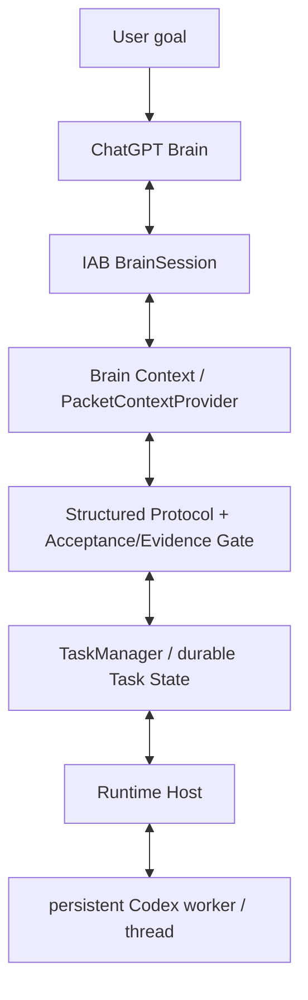

# chatgpt-codex-orchestrator

一种 Agent 编排方案，让 **ChatGPT 作为规划/评审方**、**Codex 作为本地执行方**，在一条持久、可恢复的闭环上协同完成编码任务。

**状态：** Alpha — `v0.1.0-alpha.2` · **简体中文** · [English](README.en.md)

---

## 为什么做这个项目

用 ChatGPT 做规划、用 Codex 做执行来驱动一个编码任务，第一次很容易，但要持续下去却很难：对话会漂移、执行上下文会重置、进程失败会丢失进度，而且“ChatGPT 要什么”和“Codex 实际做了什么”之间缺乏清晰的契约。

`chatgpt-codex-orchestrator` 让这条闭环变得持久可靠：

- 一个用户目标，然后由 **ChatGPT 规划**并下发 `TASK`。
- **Codex 本地执行**并返回带证据的结构化结果。
- **ChatGPT 评审**并回复 `TASK` / `REVISE` / `ASK_USER` / `DONE`。
- 任务状态、持久的 Codex 线程、以及恢复/续跑机制，让这条闭环在多轮之间保持一致，并能在可恢复的运行时故障后继续。
- 密钥会从持久化与日志化上下文中被脱敏。

## 它如何工作

核心是一个固定的角色分工。

- **ChatGPT** 是规划者与评审者：它读取目标、下发任务、评估结果，并决定何时完成。
- **Codex** 是本地执行者：它运行每个任务、修改文件、执行测试，并汇报真实的证据。
- **编排器** 是持久的“胶水”：它持久化状态、为每个任务保留一个 Codex 线程、强制执行验收/证据门禁，并在崩溃后恢复。

闭环会一直运行，直到 ChatGPT 输出 `DONE` 或 `ASK_USER`。

## 架构



## 快速开始

### 前置条件

- Node.js `>= 18`
- ESM 项目（`"type": "module"`）
- 一次**真实**的 ChatGPT-Brain 运行需要一个 Codex 应用内浏览器（IAB）运行时和一个 worker 进程——见 [SKILL.md](SKILL.md)

### 安装与测试

```bash
git clone https://github.com/SIMON-WORLD/chatgpt-codex-orchestrator.git
cd chatgpt-codex-orchestrator
npm install
npm test
```

### 使用库

```js
import { TaskService } from './src/index.js';

// A runtime must be supplied for a live ChatGPT-Brain run.
// It provides the durable store, the brain-session openers, and the
// Codex executor used by the loop. See SKILL.md for the worker/brain
// wiring and the data-root resolver.
const service = new TaskService({ stateDir });

await service.startTask({
  goal,              // e.g. "Refactor the stats module and add tests"
  repoDir,           // absolute path to the target repository
  conversation: 'new',        // supported (default)
  // conversation: 'current', // EXPERIMENTAL
});
```

一次真实的 ChatGPT-Brain 执行需要应用内浏览器会话，外加一个在普通 Node 进程中运行的 Codex worker（node-REPL 沙箱无法派生子进程 `codex`）。公开 API 以库为主；本仓库**不**附带一个打磨好的全局 CLI。

## 核心工作流与命令

这些是文档化的入口（运行时接线见 [SKILL.md](SKILL.md)）。

| 命令 | 用途 | 状态 |
|---|---|---|
| `doctor` | 预检（IAB 运行时、ChatGPT 登录、codex CLI、git、状态/日志目录、IPC、context provider） | 支持 |
| `start` | `TaskService.startTask({ goal, repoDir, conversation: 'new' })` | 支持 |
| `resume` | 为某任务恢复 / 分轮 `advanceTask` 循环 | 支持 |
| `status` | `TaskService.getTaskStatus(taskId)` | 支持 |
| `status:brain-command` | 只读检查：用户级 launcher Skill 可发现 + brain-command config 存在/可解析；打印 `orchestratorRoot` / `dataRoot` / `workspaceRoot` 与默认值；不打印任何 secret/token；正常退出 0，缺失或无效退出 1 | 支持 |
| `cancel` | `TaskService.cancelTask(taskId)` | 支持 |
| `adopt-current` | 在*当前* ChatGPT 会话中继续 | 实验性 |

### 自然语言入口

```
用 ChatGPT 指挥模式完成这个任务：<goal>
```

## Alpha.2 — 增量包 + 快速引导

- **一次性设置（用户可运行）** —— 在仓库中运行 `npm run setup:brain-command`。它会将 launcher Skill 安装到 `$HOME/.agents/skills/brain-command/SKILL.md` 并创建/更新 `$CODEX_HOME/brain-command/config.json`，确定性地解析 `orchestratorRoot`（仓库根）、`dataRoot` 与 `workspaceRoot`（可通过 `--orchestrator-root`、`--data-root`、`--workspace-root` 覆盖）。它只运行一次；正常的任务启动永远不会重复运行它。
- **`brain-command` launcher Skill** —— 面向用户的规范入口。它解析位于 `$CODEX_HOME/brain-command/config.json` 的用户级配置，确定性地解析仓库，并运行一次快速预检（不做广泛的文件系统发现）。一次性设置（`setupBrainCommand`）会把 launcher Skill 安装到 `$HOME/.agents/skills/brain-command/SKILL.md` 并写入配置；正常执行永远不会重新安装它。
- **只读状态检查** —— 运行 `npm run status:brain-command`（scripts/brain-command-status.mjs → `brainCommandStatus`）。它会验证 launcher Skill 可在 `$HOME/.agents/skills/brain-command/SKILL.md` 处找到（旧路径 `$CODEX_HOME/skills/...` 会被标记为警告），验证 `$CODEX_HOME/brain-command/config.json` 存在且可解析，然后打印 `orchestratorRoot`、`dataRoot`、`workspaceRoot`、`defaultBrain`、`defaultExecutor`、`defaultConversationMode`。它从不打印机密；退出码 0 = 健康，1 = 缺失/无效。只读，不改变编排语义。
- **增量包协议** —— `PLAN` / `REPLAN` 是 Brain → Orchestrator 的控制/状态操作（永不转发给 Codex）；正常的 `TASK` / `RESULT` 默认紧凑；旧文本协议保留为兼容回退。
- **持久状态（schema v1）** —— `taskContract`、`plan`、`repoContext`、`verificationPolicy`、`stepSummaries`、`evidenceLedger`、`unresolvedRisks`，全部在加载时被水合化。
- **分层验证** —— 步骤 / 里程碑 / 最终，带权限优先级（强制性的 Orchestrator 边界 > Brain 请求层级 > Codex 本地最低要求）。
- **Orchestrator 自有压缩** —— `reviewed -> compact` 生成持久的 `stepSummary`。
- **升级** —— 同一步骤上连续 2 次 `REVISE` 失败后，步骤包可切换到更完整的契约包。
- **Dogfood 仪器化** —— 轻量的引导/包/验证指标（不是成本台账）。

范围边界：`adopt-current` 稳定化、并行执行器、多 Brain provider、Brain Council、MCP context provider、GUI、成本台账与远程运行时在 Alpha.2 中**未**实现。

## 在 `v0.1.0-alpha.2` 中支持

- `conversation: 'new'` —— 默认、受支持的路径（新建 ChatGPT 会话 + 持久 Codex 线程）。
- ChatGPT Brain 控制闭环：`TASK` / `REVISE` / `ASK_USER` / `DONE`。
- 结构化的 `acceptance[]` 与 `evidence[]`，并在 `DONE` 时执行验收门禁（必需的验收项必须有真实的 `pass` 证据，不能仅依据 Codex 退出码推断）。
- 持久任务状态（schema v1）与分轮 `advanceTask`。
- 持久 Codex worker/线程集成（跨轮次复用同一线程）。
- `resumeTask` / `recovery_required` —— 崩溃后可继续。
- 崩溃安全的 `TaskLock`（owner pid + 心跳；过期锁会被回收）。
- Brain 项目 Profile / 项目绑定（`bindProject` / `getProjectBinding`）。
- `PacketContextProvider` —— 有界、脱敏的仓库上下文。
- `doctor` 诊断与安全默认值（默认不启用危险绕过）。

## 实验性

- `conversation: 'current'` / `adopt-current` —— 已保留，但在本 alpha 中**不构成稳定性承诺**。在当前的 Codex Desktop / IAB 环境中，所选 tab 的身份在多次 node-REPL 调用之间并不稳定。

## 限制

- Codex worker 必须运行在普通 Node 进程中；node-REPL 沙箱无法派生子进程 `codex`。
- 默认的 `%LOCALAPPDATA%` 数据根目录在沙箱中可能不可写；调用方可能需要通过 resolver 或 `CHATGPT_ORCHESTRATOR_DATA_ROOT` 提供一个可写的持久根目录。
- 本地 governor 目前会把 bearer token 作为 Codex 子进程 argv 中的参数传递；它会在日志/状态中被脱敏，但并未从进程 argv 中移除。
- 依赖 ChatGPT 的 Web DOM；若 UI 变化，选择器/占位符可能需要维护。
- 除 `resumeTask` 外没有跨进程的自动恢复机制；没有并发任务队列；没有成本台账。

## 安全与可靠性

当前这些保护属于结构性实现，而非保证：

- 持久任务状态（原子写入，并带有 `.bak` 回退）。
- 崩溃安全的随任务锁，带 owner 心跳。
- `DONE` 之前的验收/证据门禁。
- 有界、脱敏的上下文（不做整个仓库的转储）。
- 复用同一会话、同一 tab 与同一 Codex 线程的恢复/续跑。

不要把这些理解为生产就绪的安全保证——见 [限制](#限制)。

## 路线图

规划中，而非承诺：

- 稳定 `adopt-current`（通过显式 `tabId` 做身份绑定，而不是 `tabs.selected()`）。
- Cloudflare / 远程运行时。
- 成本台账。
- 更丰富的 context providers。
- 无需 GUI 的每日入口。

## 文档

- [CHANGELOG.md](CHANGELOG.md) —— 面向发布的版本历史。
- [docs/development-history.md](docs/development-history.md) —— 详细工程/开发笔记。
- [docs/architecture.md](docs/architecture.md) —— 当前架构参考。
- [CONTRIBUTING.md](CONTRIBUTING.md) —— 贡献指南。
- [SKILL.md](SKILL.md) —— agent 面向的运行时接线与命令。

## 许可协议

在 [MIT License](LICENSE) 下发布。
