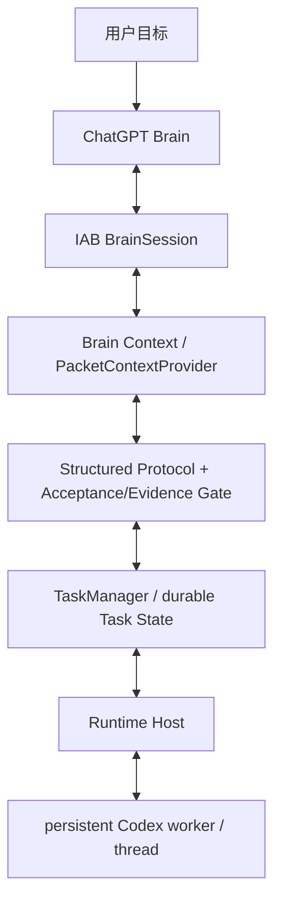

# chatgpt-codex-orchestrator

一种 Agent 编排方案，让 **ChatGPT 作为规划/评审方**、**Codex 作为本地执行方**，在一条持久、可恢复的闭环上协同完成编码任务。

**状态：** Alpha — `v0.1.0-alpha.2` · [English](README.md) | **简体中文**

---

## 为什么做这个项目

用 ChatGPT 做规划、用 Codex 做执行来驱动一个编码任务，第一次很容易，但要持续下去却很难：对话会漂移、执行上下文会重置、进程失败会丢失进度，而且“ChatGPT 要什么”和“Codex 实际做了什么”之间缺乏清晰的契约。

`chatgpt-codex-orchestrator` 让这条闭环变得持久可靠：

- 一个用户目标，然后由 **ChatGPT 规划**并下发 `TASK`。
- **Codex 本地执行**并返回带证据的结构化结果。
- **ChatGPT 评审**并回复 `TASK` / `REVISE` / `ASK_USER` / `DONE`。
- 任务状态、持久的 Codex 线程、以及恢复/续跑机制，让这条闭环在多轮之间保持一致，并能在可恢复的运行时故障后继续。
- 密钥会从持久化与日志化上下文中被脱敏。

## 它如何工作

核心是一个固定的角色分工。

- **ChatGPT** 是规划者与评审者：它读取目标、下发任务、评估结果，并决定何时完成。
- **Codex** 是本地执行者：它运行每个任务、修改文件、执行测试，并汇报真实的证据。
- **编排器** 是持久的“胶水”：它持久化状态、为每个任务保留一个 Codex 线程、强制执行验收/证据门禁，并在崩溃后恢复。

闭环会一直运行，直到 ChatGPT 输出 `DONE` 或 `ASK_USER`。

## 架构



## 快速开始

### 前置要求

- Node.js `>= 18`
- ESM 项目（`"type": "module"`）
- 若要真正运行 ChatGPT Brain，需要 Codex 应用内浏览器（IAB）运行时以及一个 worker 进程——参见 [SKILL.md](SKILL.md)

### 安装并测试

```bash
git clone https://github.com/SIMON-WORLD/chatgpt-codex-orchestrator.git
cd chatgpt-codex-orchestrator
npm install
npm test
```

### 使用库

```js
import { TaskService } from './src/index.js';

// 若要真正运行 ChatGPT Brain，必须注入一个 runtime。
// 它提供持久化存储、brain-session 打开器，以及闭环所用的 Codex executor。
// 参见 SKILL.md 中的 worker/brain 接线与 data-root 解析。
const service = new TaskService({ stateDir });

await service.startTask({
  goal,              // 例如 "Refactor the stats module and add tests"
  repoDir,           // 目标仓库的绝对路径
  conversation: 'new',        // 支持（默认）
  // conversation: 'current', // 实验性
});
```

真正运行 ChatGPT Brain 需要应用内浏览器会话，以及运行在普通 Node 进程中的 Codex worker（node-REPL 沙箱无法派生子进程 `codex`）。本仓库的公开 API 面向库使用，**并未提供一个开箱即用的全局 CLI**。

## 核心工作流与命令

以下是文档化的入口（运行时接线见 [SKILL.md](SKILL.md)）。

| 命令 | 用途 | 状态 |
|---|---|---|
| `doctor` | 预检（IAB 运行时、ChatGPT 登录、codex CLI、git、状态/日志目录、IPC、context provider） | 支持 |
| `start` | `TaskService.startTask({ goal, repoDir, conversation: 'new' })` | 支持 |
| `resume` | 恢复任务 / 分轮 `advanceTask` 循环 | 支持 |
| `status` | `TaskService.getTaskStatus(taskId)` | 支持 |
| `status:brain-command` | 只读检查：用户级 launcher Skill 是否可发现 + brain-command config 是否存在/可解析；打印 `orchestratorRoot` / `dataRoot` / `workspaceRoot` 与默认值；不输出任何 secret/token；正常退出 0，缺失或无效退出 1 | 支持 |
| `cancel` | `TaskService.cancelTask(taskId)` | 支持 |
| `adopt-current` | 在**当前** ChatGPT 会话中继续 | 实验性 |

### 自然语言入口

```
用 ChatGPT 指挥模式完成这个任务：<goal>
```

## 只读状态检查（brain-command）

运行 `npm run status:brain-command`（scripts/brain-command-status.mjs → `brainCommandStatus`）可只读检查 brain-command 是否已正确安装与配置。

- 检查用户级 launcher Skill 是否可发现（`$HOME/.agents/skills/brain-command/SKILL.md`；兼容旧路径 `$CODEX_HOME/skills/...` 会被标记为 `WARN`）。
- 检查 `$CODEX_HOME/brain-command/config.json` 是否存在且可解析。
- 打印 `orchestratorRoot`、`dataRoot`、`workspaceRoot`、`defaultBrain`、`defaultExecutor`、`defaultConversationMode`。
- 不输出任何 secret/token；整份 config 不会原样打印，仅暴露以上六个安全字段。
- 配置缺失或无效时给出明确诊断并返回非零退出码；正常状态返回 0。

该命令为只读，不改变任何编排核心语义。

## 在 `v0.1.0-alpha.1` 中支持

- `conversation: 'new'` —— 默认、支持路径（新建 ChatGPT 会话 + 持久 Codex 线程）。
- ChatGPT Brain 控制闭环：`TASK` / `REVISE` / `ASK_USER` / `DONE`。
- 结构化 `acceptance[]` 与 `evidence[]`，并在 `DONE` 时执行验收门禁（必需的验收项必须有真实的 `pass` 证据，不能仅依据 Codex 退出码推断）。
- 持久任务状态（schema v1）与分轮 `advanceTask`。
- 持久 Codex worker/线程集成（跨轮次复用同一线程）。
- `resumeTask` / `recovery_required` —— 崩溃后可继续。
- 崩溃安全的 `TaskLock`（owner pid + 心跳；过期锁会被回收）。
- Brain 项目 Profile / 项目绑定（`bindProject` / `getProjectBinding`）。
- `PacketContextProvider` —— 有界、脱敏的仓库上下文。
- `doctor` 诊断与安全默认值（默认不启用危险绕过）。

## 实验性

- `conversation: 'current'` / `adopt-current` —— 已保留，但在本 alpha 中**不构成稳定性承诺**。在当前的 Codex Desktop / IAB 环境中，所选 tab 的身份在多次 node-REPL 调用之间并不稳定。

## 限制

- Codex worker 必须运行在普通 Node 进程中；node-REPL 沙箱无法派生子进程 `codex`。
- 默认的 `%LOCALAPPDATA%` 数据根目录在沙箱中可能不可写；调用方可能需要通过 resolver 或 `CHATGPT_ORCHESTRATOR_DATA_ROOT` 提供一个可写的持久根目录。
- 本地 governor 目前会把 bearer token 作为 Codex 子进程 argv 中的参数传递；它会在日志/状态中被脱敏，但并未从进程 argv 中移除。
- 依赖 ChatGPT 的 Web DOM；若 UI 变化，选择器/占位符可能需要维护。
- 除 `resumeTask` 外没有跨进程的自动恢复机制；没有并发任务队列；没有成本台账。

## 安全与可靠性

当前这些保护属于实现机制，而不是绝对保证：

- 持久任务状态（原子写入，并带有 `.bak` 回退）。
- 崩溃安全的按任务锁（带 owner 心跳）。
- `DONE` 前的验收/证据门禁。
- 有界、脱敏的上下文（非整仓导出）。
- 恢复/续跑，复用同一会话、tab 与 Codex 线程。

请不要把这些解读为可用于生产环境的安全保证——参见[限制](#限制)。

## 路线图

以下为计划事项，并非承诺：

- 稳定 `adopt-current`（通过显式 `tabId` 进行身份绑定，而非 `tabs.selected()`）。
- Cloudflare / 远程运行时。
- 成本台账。
- 更丰富的 context providers。
- 免 GUI 的日常入口。

## 文档

- [CHANGELOG.md](CHANGELOG.md) —— 面向发布的版本历史。
- [docs/development-history.md](docs/development-history.md) —— 详细的工程 / 开发笔记。
- [docs/architecture.md](docs/architecture.md) —— 当前架构参考。
- [CONTRIBUTING.md](CONTRIBUTING.md) —— 贡献指南。
- [SKILL.md](SKILL.md) —— 面向 Agent 的运行时接线与命令。

## 许可证

基于 [MIT License](LICENSE) 发布。
