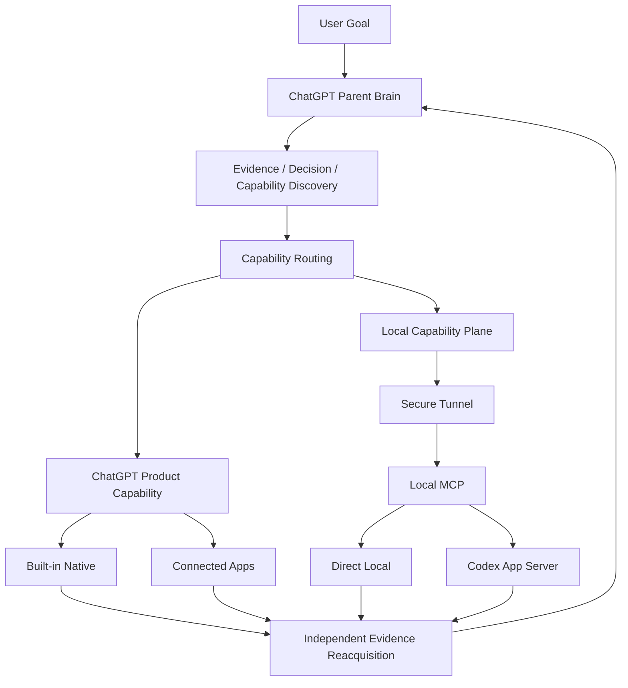

# Architecture

> **Current architecture reference:** capability-first v0.2 candidate.
>
> **Released operational default:** `v0.1.0-alpha.3` legacy IAB Direct Brain Loop remains the feature-frozen released/default path until an explicit post-hardening operational-default decision changes it.
>
> Current implementation truth is GitHub `main`; current phase/status is [`../PROJECT_STATUS.md`](../PROJECT_STATUS.md); normative routing policy is [`../CAPABILITY_ROUTING.md`](../CAPABILITY_ROUTING.md); the accepted post-M7 continuity contract is [`rfc-v0.2-brain-continuity.md`](rfc-v0.2-brain-continuity.md). Historical IAB/worker engineering detail lives in [`development-history.md`](development-history.md).

## 1. Design model

`chatgpt-codex-orchestrator` is a **Capability Orchestrator with ChatGPT as the authoritative Parent Brain**.

The core control loop is:

```text
Evidence first
→ Decision
→ Runtime Capability Discovery
→ Capability Routing
→ Execute
→ Independent Evidence Reacquisition
→ ACCEPT / REVISE / DONE
```

Responsibilities are deliberately separated:

- **ChatGPT Parent Brain** — investigation, architecture, planning, routing, governance, independent verification, `ACCEPT / REVISE / DONE`.
- **Capabilities / Executors** — perform bounded work. They do not inherit final project-level acceptance authority.
- **Codex** — sustained local coding executor for multi-file, iterative, shell-heavy, debugging, refactor, test/build work; not the default downstream for all tasks.
- **Human** — principal / product owner / risk authority. The human supplies goals, preferences, strategic correction, and approvals for genuinely high-impact decisions; the human is not an internal-ID or RESULT message bus.

Two additional principles are important for the current hardening phase:

- **Brain sessions are disposable; work state is durable.** A ChatGPT conversation is an interaction/context surface, not the durable identity of a project/task.
- **Delegate outcomes, not keystrokes.** The Brain delegates milestone-sized outcomes, scope, constraints, and acceptance; an executor owns its local implementation tactics inside that boundary.

## 2. Capability architecture



### ChatGPT Product Capability

Capabilities already available to the current ChatGPT runtime, including built-in Web/Search, Files/PDF/vision, Python/Data Analysis, Images, Artifacts, Tasks, and connected Apps such as GitHub, Gmail, Calendar, Notion, Figma, etc.

These capabilities are **not reimplemented locally merely for architectural uniformity**.

### Local Capability Plane

`Custom MCP App + Secure Tunnel + Local MCP` supplies capability that the ChatGPT product cannot directly provide for the user's local machine/workspace.

It is not a mandatory hop for native-only work.

Current local families:

- **Direct Local** — workspace read/search/status/diff, small bounded exact edits, allowlisted/focused verification.
- **Codex App Server** — sustained local coding execution.

## 3. Four routing targets

The top-level routes are:

- `CHATGPT_NATIVE`
- `CHATGPT_DIRECT_LOCAL`
- `CODEX_DELEGATE`
- `HYBRID`

A route is an executor family, not a provider name. GitHub, Gmail, Notion, Figma, Web, etc. do not each become a new route.

### `CHATGPT_NATIVE`

Use current ChatGPT Product Capability when it is sufficient. Native evidence and execution are preferred when the Brain already has the right capability.

### `CHATGPT_DIRECT_LOCAL`

Use the Local Capability Plane for bounded local operations whose intended effect is already known and safely constrained.

### `CODEX_DELEGATE`

Use Codex for sustained coding/debug/refactor/test/build loops. Codex may inspect, edit, debug, test, and correct within one delegated milestone without returning to the Parent after every local command.

### `HYBRID`

Composition of capability planes within one logical task, for example:

```text
ChatGPT Native investigation
→ Brain architecture decision
→ Codex local implementation + tests + push
→ ChatGPT Native GitHub/CI evidence reacquisition
→ Brain ACCEPT / REVISE
```

`HYBRID` is not an executor and is not a mutation owner.

## 4. Runtime capability discovery

Capability availability is a **runtime fact**, not a permanent project property.

The Brain distinguishes at least:

```text
tool exposed?
provider connected?
resource authorized?
operation permitted?
```

A successful capability observation is scoped by capability/provider/resource/operation and time. Prior availability is not timeless proof of current availability.

Capability assumptions should be refreshed when appropriate, including:

- replacement ChatGPT conversation / Brain re-entry;
- local runtime restart;
- provider/tool failure;
- resource change;
- after long-running execution when a new external action is required;
- write/destructive/publish/release boundaries.

The normative policy is [`../CAPABILITY_ROUTING.md`](../CAPABILITY_ROUTING.md).

## 5. Canonical v0.2 runtime components

### Production entry

- [`../scripts/v0.2-start.mjs`](../scripts/v0.2-start.mjs) — v0.2 local runtime entrypoint.
- [`../src/transport/brain-local.js`](../src/transport/brain-local.js) — assembles the local capability plane.

### Workspace capability

- `src/local/workspace.js` — explicit allowed workspace registry / authorization.
- `src/local/read.js`, `search.js`, `git.js` — bounded read/search/git status/diff.
- `src/local/change-set.js` — bounded Direct Local change-set mutation.
- `src/local/verify.js` — allowlisted verification.
- `src/local/sensitive.js` — sensitive-path restrictions.

### MCP surface

- `src/mcp/server.js` — MCP HTTP server.
- `src/mcp/tools.js` — Direct Local, Router/Governance, and Codex facade tools.

### Routing and Governance

- `src/router/decide.js`, `src/router/capability-router.js` — deterministic routing over structured task facts. Natural-language project reasoning remains with ChatGPT.
- `src/governance/index.js` — canonical Brain control lifecycle and acceptance/evidence gates.

### Codex executor

- `src/executor/app-server-client.js` — Codex App Server client.
- `src/executor/app-server-executor.js` — structured Codex execution/reconciliation/approval lifecycle.
- `src/executor/job-map.js` — durable Codex job ↔ thread/turn mapping plus M7-C durable orchestration bindings.

### State / safety

- `src/runtime-paths.js` — unified user-level `dataRoot`, outside target repos.
- `src/state/operation-state.js` — durable bounded Direct Local operation state.
- `src/state/mutation-owner.js` — current process-local workspace mutation ownership.
- `src/state/handoff.js` — compact structured handoff.
- `src/task-state.js`, `src/task-lock.js` — legacy/reusable persistence and lock patterns; `task-state.js` supplies versioned atomic JSON + backup/corruption patterns reused as design evidence for Brain Continuity.

### Compatibility barrel

`src/index.js` intentionally re-exports both legacy and v0.2 modules for backward compatibility. It is **not** the canonical v0.2 runtime import root.

## 6. Governance semantics

Canonical controls:

```text
PLAN
TASK
RESULT
REVISE
REPLAN
ASK_USER
PUBLISH
DONE
```

Important authority boundaries:

- `TASK` / `REVISE` authorize execution; they do not prove correctness.
- Executor `RESULT` supplies structured executor status/evidence candidates.
- The machine computes acceptance/evidence gates.
- Only the Brain may make project-level acceptance decisions.
- `PUBLISH` authorizes publication when its gates pass.
- `DONE` is terminal; it never implicitly authorizes publication.

Executor success alone is insufficient for acceptance.

## 7. Evidence model

Typical evidence priority:

```text
Brain direct authoritative evidence
>
independently reacquired resource evidence
>
Executor RESULT / self-report
```

Examples:

- Codex reports a commit/test result → Brain independently reads GitHub commit/diff/CI.
- Direct Local edit → Brain/local verification re-reads the file/diff and runs the required check.
- GitHub mutation returns success → Brain can re-read the resulting remote state before final acceptance.

Independent verification means independent reacquisition of resource truth; it does not require a different provider merely for formality.

## 8. Persistence and recovery — current implementation

### Already durable

- **Codex JobMap:** durable job/thread/turn mapping plus `taskId / stepId / identity` binding; M7-C adds bounded `codex_recover`.
- **Direct Local OperationState:** durable operation state for bounded edits/reconciliation.
- **Legacy Task State:** versioned JSON, atomic temp-write + rename, `.bak` fallback, corruption fail-closed; retained as a proven persistence pattern.

### Current blocking gap

`GovernanceService` is currently instantiated from fresh in-memory state by the v0.2 runtime. Therefore executor execution may remain recoverable while Brain governance task/step/acceptance/evidence authority is lost across local runtime restart.

This is the current post-M7 default-flip blocker. The accepted contract is [`rfc-v0.2-brain-continuity.md`](rfc-v0.2-brain-continuity.md).

## 9. Brain Continuity target contract — accepted, implementation pending

The accepted contract requires, at minimum:

- versioned durable canonical Governance state under the existing `dataRoot`;
- atomic persistence + known-good backup + corruption/future-schema fail-closed behavior;
- bounded semantic project/task recovery (`not_found` / unique / `ambiguous`), never “resume most recent” guessing;
- Parent authority generation/fencing so a replaced/stale Parent cannot issue later mutations;
- Parent takeover that does not duplicate/cancel an already-valid delegated Codex execution;
- one canonical local Governance writer per namespace;
- bounded Context Capsule generation for replacement Brain sessions;
- capability rediscovery after re-entry;
- proof-reuse cache loss may only force conservative re-verification, never implicit PASS;
- isolated restart/conversation-re-entry dogfood with zero manual internal-ID/RESULT relay.

Until implementation and real dogfood pass, the operational default remains Alpha.3 legacy IAB.

## 10. Mutation / authority scopes

Do not collapse distinct ownership scopes:

1. **Parent authority** — which Parent Brain generation may issue new governance mutations.
2. **Governance runtime writer** — which local runtime may persist a Governance namespace.
3. **Resource mutation owner** — which executor may mutate a particular workspace/resource.

Current safety policy remains: one authoritative writer per mutable resource. Read-only work should not acquire write ownership.

No distributed lock manager is part of the current v0.2 contract.

## 11. Released Alpha.3 legacy path

The latest formal release is still `v0.1.0-alpha.3`.

Its operational default is the feature-frozen IAB Direct Brain Loop, whose browser/worker implementation is isolated under `src/legacy/` and whose released instructions are preserved in [`../SKILL.md`](../SKILL.md) and `skills/brain-command/SKILL.md`.

This fallback remains intentionally present until a later explicit operational-default decision. v0.2 architecture acceptance and M7 completion did **not** automatically delete or flip the released path.

Historical implementation detail is kept in [`development-history.md`](development-history.md).

## 12. Current boundaries / non-goals

For the current Brain Continuity hardening, these are explicit non-goals:

- multi-Child scheduler / recursive Child tree;
- generic work DAG;
- multiple authoritative Parent Brains / consensus;
- distributed database/workflow service/lock manager;
- Codex Desktop sidebar integration;
- rich execution dashboard;
- “resume most recent” recovery heuristics.

Future multi-workstream support, if justified by real long-running projects, should persist the **workstream** rather than treating a Child conversation as durable identity.

## 13. Documentation authority

Use the following order when determining current truth:

1. GitHub current code / PR / CI / release state — implementation truth.
2. [`../PROJECT_STATUS.md`](../PROJECT_STATUS.md) — current project phase and active gate.
3. [`../CAPABILITY_ROUTING.md`](../CAPABILITY_ROUTING.md) — current normative routing/executor policy.
4. This file — current technical architecture reference.
5. [`rfc-v0.2-brain-continuity.md`](rfc-v0.2-brain-continuity.md) — accepted continuity contract pending implementation.
6. Historical RFCs / [`development-history.md`](development-history.md) — design/evidence history, not automatic current operating truth.

See [`README.md`](README.md) for the complete docs index and supersession notes.
