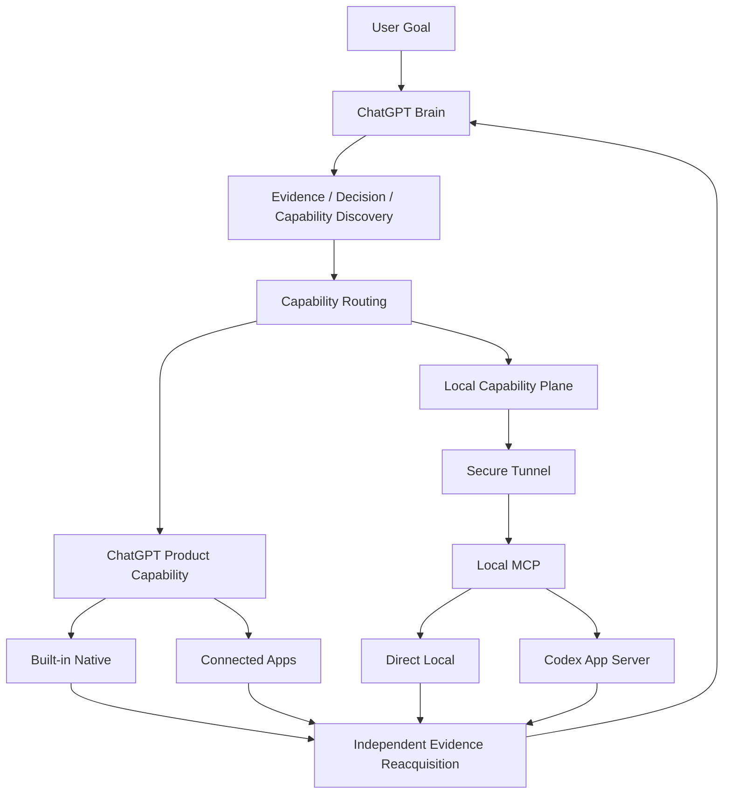

# Architecture

> **Current architecture / operational default:** capability-first v0.2.
>
> **Release distinction:** `v0.2.0` is formally released; GitHub tag / Release readback is publication truth. The legacy `v0.1.0-alpha.3` IAB Direct Brain Loop is retained feature-frozen as an explicit compatibility/fallback path only, not the repository operational default and never a silent fallback.
>
> Current implementation truth is GitHub `main`; normative routing / Parent-mission policy is [`../CAPABILITY_ROUTING.md`](../CAPABILITY_ROUTING.md); current phase/status is [`../PROJECT_STATUS.md`](../PROJECT_STATUS.md); accepted high-level path is [`../ROADMAP.md`](../ROADMAP.md); the accepted continuity contract is [`rfc-v0.2-brain-continuity.md`](rfc-v0.2-brain-continuity.md). Historical IAB/worker engineering detail lives in [`development-history.md`](development-history.md).

## 1. Design model

`chatgpt-codex-orchestrator` is a **Capability Orchestrator with ChatGPT as the authoritative Brain**.

The core control loop is:

```text
Evidence first
→ Decision
→ Runtime Capability Discovery
→ Capability Routing
→ Execute
→ Independent Evidence Reacquisition
→ ACCEPT / REVISE / DONE
```

Responsibilities are deliberately separated:

- **ChatGPT Brain** — investigation, architecture, planning, routing, governance, independent verification, `ACCEPT / REVISE / DONE`.
- **Capabilities / Executors** — perform bounded work. They do not inherit final project-level acceptance authority.
- **Codex** — sustained local coding executor for multi-file, iterative, shell-heavy, debugging, refactor, test/build work; not the default downstream for all tasks.
- **Human** — principal / product owner / risk authority. The human supplies goals, preferences, strategic correction, and approvals for genuinely high-impact decisions; the human is not an internal-ID or RESULT message bus.

Two additional principles are part of the current operating model:

- **Brain sessions are disposable; work state is durable.** A ChatGPT conversation is an interaction/context surface, not the durable identity of a project/task.
- **Delegate outcomes, not keystrokes.** The Brain delegates milestone-sized outcomes, scope, constraints, and acceptance; an executor owns its local implementation tactics inside that boundary.

Current session policy is **Thin Parent / Strong Mission / exception-based escalation**. The ongoing project Parent owns architecture/policy/mission acceptance/default-release decisions but does not sit in the routine implementation hot path; bounded mission sessions continuously progress inside an authorized contract and use direct durable handoff instead of Human Relay. Ongoing Parent, bounded Parent delegation, `ACTIVE`/`RETIRED` naming, No Human Relay, and Act-or-Escalate / no Continue Tax semantics are normative in [`../CAPABILITY_ROUTING.md`](../CAPABILITY_ROUTING.md), not duplicated as a second authority model here.

## 2. Capability architecture



### ChatGPT Product Capability

Capabilities exposed by the **current ChatGPT runtime**. Treat these as runtime-discovered categories rather than a static global product registry: built-in research/browsing, file/data/media/artifact/workspace capabilities, connected plugins/apps, and future product capabilities may vary by surface, rollout, plan/workspace settings, provider connection, resource authorization, and operation permission.

These capabilities are **not reimplemented locally merely for architectural uniformity**, and historical inventory observations are not treated as timeless availability guarantees.

### Local Capability Plane

The human-facing custom App is **Local Connector**: `Connect ChatGPT to authorized files, workspaces, and local execution capabilities on your computer.` Repository/server/programmatic identity remains `chatgpt-codex-orchestrator`; DesktopCommander is dependency/provenance rather than product branding ([#119](https://github.com/SIMON-WORLD/chatgpt-codex-orchestrator/issues/119)).

`Custom MCP App + Secure Tunnel + thin Orchestrator HTTP MCP façade` supplies capability that the ChatGPT product cannot directly provide for the user's local machine. It is not a mandatory hop for native-only work.

The accepted Local execution architecture is the **composite DesktopCommander engine** ([#116](https://github.com/SIMON-WORLD/chatgpt-codex-orchestrator/issues/116), [#117](https://github.com/SIMON-WORLD/chatgpt-codex-orchestrator/issues/117), [#120](https://github.com/SIMON-WORLD/chatgpt-codex-orchestrator/issues/120)):

```text
ChatGPT
  → Local Connector custom App
  → existing Secure MCP Tunnel
  → thin Orchestrator HTTP MCP façade
       → parent-owned resource / security / normalization checks
       → exact-pinned @wonderwhy-er/desktop-commander@0.2.51 child over stdio
            → bounded commodity read / search / fixed git status+diff execution
       → bounded Direct Local edit / verify
       → durable Governance / continuity where evidenced
       → separate Codex App Server adapter for sustained execution
```

Hosted Remote Desktop Commander is **not** a current execution dependency. #120 removed the superseded bespoke direct read/search/git execution fallbacks; the remaining `src/local/read.js`, `search.js` and `git.js` paths are parent-side contract/validation/dispatch layers around the child, not a second commodity execution engine. Generic DesktopCommander shell/process/config/write-file actions are not public Local Connector capabilities; private child process mechanics are used only behind the fixed Orchestrator-owned git path.

Current local families remain:

- **Direct Local** — bounded local read/search/status/diff through the composite child plus small exact edits and allowlisted/focused verification.
- **Codex App Server** — separate sustained local coding execution.

#### Local resource authority

The accepted model from [#123](https://github.com/SIMON-WORLD/chatgpt-codex-orchestrator/issues/123), [#124](https://github.com/SIMON-WORLD/chatgpt-codex-orchestrator/issues/124) and real custom-App dogfood [#127](https://github.com/SIMON-WORLD/chatgpt-codex-orchestrator/issues/127) rejects the old universal equation `PRIMARY_WORKSPACE == COMPLETE_LOCAL_RESOURCE_AUTHORITY`:

- **primary workspace** = primary task context + default mutation root;
- **Host trust ceiling** = coarse Human/admin maximum;
- **secondary read grants** = explicit mission/session-scoped auxiliary file/root read/search authority bound through read-only `workspace_open.secondaryReadGrants` handles.

Ordinary secondary reads require no Governance mutation and no per-mission Stable Runtime trust-root restart/reconfiguration. Ungranted/sibling access fails closed and external write remains unauthorized. Direct Local edit, Codex writable roots, process/shell, network, MutationOwner, Repository Identity Fence and Parent authority semantics remain unchanged. This is not generic RBAC, machine-wide ambient read, multi-root mutation or a resource registry.

#### DesktopCommander dependency continuity and security

The exact DesktopCommander 0.2.51 npm artifact and exact upstream source commit `092ce0b841e86455f12e41f4dc36399a7522ecb5` are preserved in the project-owned [dependency-escrow prerelease](https://github.com/SIMON-WORLD/chatgpt-codex-orchestrator/releases/tag/dependency-escrow-desktop-commander-0.2.51), with repository pointer [`dependency-escrow/desktop-commander-0.2.51.json`](../dependency-escrow/desktop-commander-0.2.51.json). [#122](https://github.com/SIMON-WORLD/chatgpt-codex-orchestrator/issues/122) proved project-owned retrieval plus bounded cold recovery without live DesktopCommander npm/GitHub source. Escrow is supply continuity, not a product release/default change, maintained fork or mirror service.

The current production dependency audit still reports **2 high + 2 moderate package objects** through DesktopCommander transitives; the current underlying advisory paths are `sharp` and `uuid`. Under [#128](https://github.com/SIMON-WORLD/chatgpt-codex-orchestrator/issues/128), Parent accepted the material advisories as `NOT_REACHABLE_BY_EVIDENCE` for the **current accepted Local Connector surface** because the relevant special-format/generic child paths are excluded by the parent contract. Current Local Connector usage therefore need not pause and the exact 0.2.51 pin remains. This is surface-specific, not a claim that 0.2.51 is generally vulnerability-free. Re-evaluate when upstream ships a real fixing candidate or before expanding into excluded special-format/generic DesktopCommander surfaces.

## 3. Four routing targets

The top-level routes are:

- `CHATGPT_NATIVE`
- `CHATGPT_DIRECT_LOCAL`
- `CODEX_DELEGATE`
- `HYBRID`

A route is an executor family, not a provider name. Individual plugins, apps, providers, or product surfaces do not each become a new route.

### `CHATGPT_NATIVE`

Use current ChatGPT Product Capability when it is sufficient. Native evidence and execution are preferred when the Brain already has the right capability.

### `CHATGPT_DIRECT_LOCAL`

Use the Local Capability Plane for bounded local operations whose intended effect is already known and safely constrained.

### `CODEX_DELEGATE`

Use Codex for sustained coding/debug/refactor/test/build loops. Codex may inspect, edit, debug, test, and correct within one delegated milestone without returning to the Parent after every local command.

### `HYBRID`

Composition of capability planes within one logical task, for example:

```text
ChatGPT Native investigation
→ Brain architecture decision
→ Codex local implementation + tests + push
→ ChatGPT Native GitHub/CI evidence reacquisition
→ Brain ACCEPT / REVISE
```

`HYBRID` is not an executor and is not a mutation owner.

## 4. Runtime capability discovery

Capability availability is a **runtime fact**, not a permanent project property.

The Brain distinguishes at least:

```text
tool / action exposed in this conversation?
provider connected?
resource authorized?
operation permitted?
execution constraints sufficient for this task?
```

A successful capability observation is scoped by capability/provider/resource/operation and time. Prior availability is not timeless proof of current availability.

Capability assumptions should be refreshed when appropriate, including:

- replacement ChatGPT conversation / Brain re-entry;
- local runtime restart;
- provider/tool failure;
- resource change;
- after long-running execution when a new external action is required;
- write/destructive/publish/release boundaries.

The normative policy is [`../CAPABILITY_ROUTING.md`](../CAPABILITY_ROUTING.md).

## 5. Canonical v0.2 runtime components

### Production entry

- [`../scripts/v0.2-start.mjs`](../scripts/v0.2-start.mjs) — v0.2 local runtime entrypoint.
- [`../src/transport/brain-local.js`](../src/transport/brain-local.js) — assembles the local capability plane.

### Workspace / Local execution capability

- `src/local/workspace.js` — primary-workspace binding plus explicit read-only secondary grant binding inside the Host trust ceiling; the primary workspace is context/default mutation root, not the complete Local read authority set.
- `src/local/desktop-commander-child.js` — exact-pinned DesktopCommander child MCP lifecycle/stdio adapter used for the accepted commodity execution subset and lazy child recovery.
- `src/local/read.js`, `search.js`, `git.js` — parent-side authorization, canonicalization, sensitive/special-format/budget checks and fixed dispatch into the DesktopCommander child. They are no longer independent bespoke commodity execution fallbacks.
- `src/local/change-set.js` — bounded Direct Local change-set mutation; external secondary-read resources do not become writable.
- `src/local/verify.js` — allowlisted verification.
- `src/local/sensitive.js` — sensitive-path restrictions.

### MCP surface

- `src/mcp/server.js` — MCP HTTP server.
- `src/mcp/tools.js` — Direct Local, Router/Governance, and Codex facade tools.

### Routing and Governance

- `src/router/decide.js`, `src/router/capability-router.js` — deterministic routing over structured task facts. Natural-language project reasoning remains with ChatGPT.
- `src/governance/index.js` — canonical Brain control lifecycle and acceptance/evidence gates.
- `governance_plan` is the dedicated low-risk PLAN-only MCP wrapper accepted by [#111](https://github.com/SIMON-WORLD/chatgpt-codex-orchestrator/issues/111). Its Orchestrator implementation is complete; the current observed downstream blocker is an upstream ChatGPT Developer-MCP product safety pre-check **before Local Governance execution**. The accepted response is to preserve Governance semantics and wait for material Product capability change rather than repeatedly retrying, relabeling or weakening the control.
- Brain Continuity core (`src/governance/store.js`, `writer-guard.js`, `durable.js`, `capsule.js`, `observation.js`) — durable canonical Governance under the existing `dataRoot` (`runtime/governance/<namespace>/`) with versioned schema, atomic write + known-good backup, fail-closed load/migration, one canonical Governance writer per namespace, Parent authority generation/fencing (`stale_authority`), bounded semantic re-entry (0/1/>1), bounded Context Capsule, and ephemeral capability observations. Wired as the canonical runtime Governance service in `src/transport/brain-local.js`.

### Codex executor

- `src/executor/app-server-client.js` — Codex App Server client.
- `src/executor/app-server-executor.js` — structured Codex execution/reconciliation/approval lifecycle.
- `src/executor/job-map.js` — durable Codex job ↔ thread/turn mapping plus M7-C durable orchestration bindings.

### State / safety

- `src/runtime-paths.js` — unified user-level `dataRoot`, outside target repos.
- `src/state/operation-state.js` — durable bounded Direct Local operation state.
- `src/state/mutation-owner.js` — current process-local workspace mutation ownership.
- `src/state/handoff.js` — compact structured handoff.
- `src/task-state.js`, `src/task-lock.js` — legacy/reusable persistence and lock patterns; `task-state.js` supplies versioned atomic JSON + backup/corruption patterns reused as design evidence for Brain Continuity.

### Compatibility barrel

`src/index.js` intentionally re-exports both legacy and v0.2 modules for backward compatibility. It is **not** the canonical v0.2 runtime import root.

## 6. Governance semantics

Canonical controls:

```text
PLAN
TASK
RESULT
REVISE
REPLAN
ASK_USER
PUBLISH
DONE
```

Important authority boundaries:

- `TASK` / `REVISE` authorize execution; they do not prove correctness.
- Executor `RESULT` supplies structured executor status/evidence candidates.
- The machine computes acceptance/evidence gates.
- Only the Brain may make project-level acceptance decisions.
- `PUBLISH` authorizes publication when its gates pass.
- `DONE` is terminal; it never implicitly authorizes publication.

Executor success alone is insufficient for acceptance.

## 7. Evidence model

Typical evidence priority:

```text
Brain direct authoritative evidence
>
independently reacquired resource evidence
>
Executor RESULT / self-report
```

Examples:

- Codex reports a commit/test result → Brain independently reads GitHub commit/diff/CI.
- Direct Local edit → Brain/local verification re-reads the file/diff and runs the required check.
- GitHub mutation returns success → Brain can re-read the resulting remote state before final acceptance.

Independent verification means independent reacquisition of resource truth; it does not require a different provider merely for formality.

## 8. Persistence and recovery — current implementation

### Already durable

- **Codex JobMap:** durable job/thread/turn mapping plus `taskId / stepId / identity` binding; M7-C adds bounded `codex_recover`.
- **Direct Local OperationState:** durable operation state for bounded edits/reconciliation.
- **Legacy Task State:** versioned JSON, atomic temp-write + rename, `.bak` fallback, corruption fail-closed; retained as a proven persistence pattern.

### Durable Governance / Brain Continuity — implemented and accepted

Canonical v0.2 runtime assembly now uses `createDurableGovernanceService` under the configured `dataRoot` / Governance namespace. It preserves task/step/acceptance/evidence/control state across runtime replacement, enforces one canonical Governance writer, provides bounded semantic recovery and Context Capsules, and fences stale Parent generations. Issue #23 / PR #24 plus formal restart/re-entry dogfood are **CLOSED / ACCEPTED**.

Post-continuity hardening is also accepted: Issue #34 adds bounded current-step Direct Local execution continuation without Parent takeover, and Issue #36 provides exact-revision Stable Runtime activation. These are implementation facts, not new mandatory routing hops.

## 9. Brain Continuity contract — accepted / implemented / dogfood complete

The accepted contract, now implemented and exercised in real restart/re-entry dogfood, requires at minimum:

- versioned durable canonical Governance state under the existing `dataRoot`;
- atomic persistence + known-good backup + corruption/future-schema fail-closed behavior;
- bounded semantic project/task recovery (`not_found` / unique / `ambiguous`), never “resume most recent” guessing;
- Parent authority generation/fencing so a replaced/stale Parent cannot issue later mutations;
- Parent takeover that does not duplicate/cancel an already-valid delegated Codex execution;
- one canonical local Governance writer per namespace;
- bounded Context Capsule generation for replacement Brain sessions;
- capability rediscovery after re-entry;
- proof-reuse cache loss may only force conservative re-verification, never implicit PASS;
- isolated restart/conversation-re-entry dogfood with zero manual internal-ID/RESULT relay.

Implementation and real dogfood have passed. Capability observations remain ephemeral after re-entry, and the v0.2 operational default still fails closed on ambiguity. Brain Continuity completion did not itself authorize release; the later, separate Issue #46 / M8 release-control flow completed and formally published `v0.2.0`.

## 10. Mutation / authority scopes

Do not collapse distinct ownership scopes:

1. **Parent authority** — which Parent Brain generation may issue new governance mutations.
2. **Governance runtime writer** — which local runtime may persist a Governance namespace.
3. **Resource mutation owner** — which executor may mutate a particular workspace/resource.

Current safety policy remains: one authoritative writer per mutable resource. Read-only work should not acquire write ownership.

No distributed lock manager is part of the current v0.2 contract.

## 11. Release / Alpha.3 compatibility boundary

The latest formal release is **`v0.2.0`**, as proven by GitHub tag / Release readback.

The historical `v0.1.0-alpha.3` feature-frozen IAB Direct Brain Loop implementation remains isolated under `src/legacy/`. Under the current repository operating contract it is an **explicit compatibility/fallback path only**; capability/provider failure never silently routes into it.

Issue #33's v0.2 default flip and Issue #46's later release publication were separate control decisions. Issue #46 is now **CLOSED / DONE** and retained as historical release-control evidence; it is not current live release authority.

Historical implementation detail is kept in [`development-history.md`](development-history.md).

## 12. Current boundaries / non-goals

For the current v0.2 operating model, these remain explicit non-goals:

- multi-Child scheduler / recursive Child tree;
- generic work DAG;
- multiple authoritative Parent Brains / consensus;
- distributed database/workflow service/lock manager;
- Codex Desktop sidebar integration;
- rich execution dashboard;
- “resume most recent” recovery heuristics;
- a static global registry of ChatGPT product capabilities/plans;
- automatic synchronization of ChatGPT Project UI mirrors after routine repository changes.

Future multi-workstream support, if justified by real long-running projects, should persist the **workstream** rather than treating a Child conversation as durable identity.

## 13. Documentation authority and recovery

For a fresh session / replacement Brain, use this stable recovery sequence:

```text
GitHub current main
→ CAPABILITY_ROUTING.md
→ PROJECT_STATUS.md
→ ROADMAP.md
→ active Issue / mission, if any
→ runtime capability discovery
→ act or escalate
```

Interpret the sources as follows:

1. GitHub current `main`, code, PRs, CI, tags, Releases, and active Issue/mission — implementation/project/publication truth.
2. [`../CAPABILITY_ROUTING.md`](../CAPABILITY_ROUTING.md) — current normative routing/executor/Parent-mission policy.
3. [`../PROJECT_STATUS.md`](../PROJECT_STATUS.md) — current stable project status baseline.
4. [`../ROADMAP.md`](../ROADMAP.md) — accepted high-level path and current operating state.
5. Durable Local Governance — live local control truth when the Local Capability Plane is involved.
6. This file — current technical architecture reference.
7. [`rfc-v0.2-brain-continuity.md`](rfc-v0.2-brain-continuity.md) — accepted continuity contract and historical design rationale; implementation + real dogfood are complete.
8. Historical RFCs / [`development-history.md`](development-history.md) — dated design/evidence history, not automatic current operating truth.

ChatGPT Project Instructions / static Project Sources are downstream convenience mirrors. They should remain slow-changing recovery aids, must not override newer GitHub evidence, and are not required to be byte-for-byte synchronized after routine PRs/issues/CI changes.

See [`../README.md`](../README.md) for the complete docs index and supersession notes.
