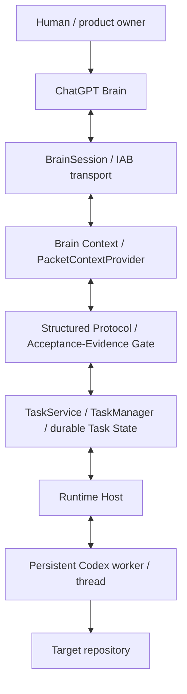

# Architecture

> Scope: current architecture of **v0.1.0-alpha.3** (Direct Brain Loop baseline; legacy detached runtime retained as experimental).
> [`README.md`](../README.md) is the project overview; [`README.zh-CN.md`](../README.zh-CN.md) is its Chinese counterpart. [`development-history.md`](development-history.md) holds the historical implementation notes that predate the public-polish pass.

---

> **Default path (current Batch): Direct Brain Loop.** The default `$brain-command` uses the current Codex agent + the Codex built-in browser to talk to ChatGPT (one dedicated conversation), executes each `TASK` directly, sends a compact `RESULT`, and publishes on `DONE`. It does **not** start a worker, a ready file, or a nested Codex executor (see `skills/brain-command/SKILL.md` and `src/legacy/direct-mode.js`).
>
> **Existing conversation:** `$brain-command --conversation "<title>"` / `--conversation-url <url>` / `--adopt-current` adopt an existing ChatGPT history conversation (no new conversation).
>
> **The rest of this document describes the LEGACY / EXPERIMENTAL detached runtime** (worker host, TaskService / TaskManager, durable recovery). It is retained for compatibility and is **not** the canonical startup path.

## Design Model

The project is built on a fixed responsibility split that gives every turn an explicit owner.

- **ChatGPT** — planner, reviewer, and control-decision maker. It reads the goal, issues an instruction, evaluates the returned evidence, and decides the next control.
- **Codex** — local executor. It runs one instructed task, modifies files, runs commands/tests, and returns an actual result plus evidence. It does not independently re-plan the overall goal.
- **Human** — product owner. The loop pauses at `ASK_USER` and waits for a human decision.

Why this separation matters:

- Explicit ownership of *planning* vs *execution* keeps each step reviewable.
- Each task is a bounded, discrete unit with its own acceptance criteria.
- Orchestration state makes the loop durable across turns and recoverable runtimes.
- The executor (Codex) reports real evidence, so the reviewer (ChatGPT) decides on facts rather than assumptions.

## System Architecture

The orchestrator lives between the ChatGPT Brain and the Codex executor. It does **not** add a remote runtime or any unsupported external service in this alpha.

## Control Protocol

The Brain ↔ executor contract uses four directives, implemented in [`src/directives.js`](../src/directives.js) and normalized in [`src/protocol.js`](../src/protocol.js):

- `TASK` — a new instruction for Codex to execute.
- `REVISE` — rework the previous task.
- `ASK_USER` — a human decision is required; the loop pauses.
- `DONE` — the task is complete.

`parseControl(text)` detects the control; `extractDirective(text, control)` pulls the instruction after the token. `normalizeBrainOutput` / `parseBrainOutput` parse structured JSON control/reply when present, with a single auto-repair and a legacy text fallback. `validateControl` rejects anything outside `CONTROLS = ['TASK','REVISE','ASK_USER','DONE']`, throwing `ProtocolError` when invalid.

The exported `CONTROLS`, `RESULT_STATUSES`, and result helpers live in [`src/protocol.js`](../src/protocol.js).

## Task Lifecycle

The lifecycle is owned by [`TaskService`](../src/task-service.js) over a durable store backed by [`TaskManager`](../src/task-manager.js) and [`task-state`](../src/task-state.js).

- `startTask({ goal, repoDir, conversation })` creates state and drives the loop (up to `maxRounds`).
- `createTask(...)` creates a task **without** running the engine; the host then calls `advanceTask(taskId)` repeatedly.
- `advanceTask(taskId, { brain, executor, sessionFactory })` is the **turn-sliced** drive: it loads durable state, performs **one** bounded unit (a single Brain send, a single Codex exec, or a state transition), persists, and returns a compact status. Each unit stays well under a node-REPL invocation time cap.
- `resumeTask(taskId)` reloads state, re-acquires the lock, re-attaches the Brain and worker, and continues.
- `getTaskStatus` / `cancelTask` are read / terminal operations.

Every mutation is persisted; completed steps are never re-run.

### State model

On-disk as `<stateDir>/<taskId>.json` with a `.bak` fallback. Schema version is `1`

- Task statuses: `running | awaiting_user | recovery_required | completed | failed | cancelled`
- Step statuses: `received | executing | executed | result_recorded | result_sent | reviewed`
- Acceptance statuses: `pass | fail | unknown | missing`

`loadState` refuses to silently reset: if both the primary file and its backup are corrupt it throws `TaskStateCorruptError`.

## Acceptance and Evidence Gate

[`src/protocol.js`](../src/protocol.js) models acceptance as structured data:

- `acceptance[]` — the criteria ChatGPT attaches to a `TASK`.
- `evidence[]` — the items Codex returns, each `{ acceptanceId, status: pass|fail|unknown, kind, summary }`.
- Evidence kinds: `command | test | file | diff | verify`.

`checkAcceptanceGate(registry)` requires **every required** acceptance to have `pass` evidence before `DONE` is accepted. The engine never marks an acceptance `pass` merely because the Codex process exited `0`; evidence must come from the returned result (`evidence[]` or an `EVIDENCE:` block) or explicit test results. `normalizeEvidence` accepts `passed/failed` aliases; `parseEvidenceBlock` handles JSON arrays.

This is a review gate, **not** formal verification, cryptographic attestation, or an automatic correctness proof.

## Persistence and Recovery

What exists:

- Durable Task State (schema v1) written atomically (temp + rename) with a retained `.bak`.
- `resumeTask` re-attaches the same conversation, tab (or re-bound conversation), and Codex thread/session.
- `recovery_required` marks a task whose in-flight step hit an unconfirmed side-effect; resume does **not** auto re-run it.
- Crash-safe `TaskLock` writes an owner token + pid + heartbeat. On contention it checks liveness/staleness: an active owner is rejected (`TaskLockedError`), and a dead/stale lock is reclaimed.
- A persistent Codex worker/thread is kept in-process by the worker host so a task re-uses the same thread.

What does **not** yet exist:

- Cross-process automatic recovery beyond explicit `resume`/`advanceTask`.
- A concurrent task queue.
- A cost ledger.

Tasks are not claimed to be impossible to lose; recovery is explicit, not automatic.

## Conversation Binding

- `conversation: 'new'` — the supported/default path. It creates a fresh ChatGPT conversation and a persistent Codex thread.
- `conversation: 'current'` / `adopt-current` — **experimental**. For `'current'`, `createTask` freezes the real conversation identity at creation time and marks the task as `adopted`; teardown does not close the adopted user tab by default. The identity-binding resolver (`reopenConversationFromBinding`, `openBrainSessionExisting`) and `ConversationIdentityMismatchError` are present.
- Why `adopt-current` is experimental in alpha.1: selected-tab identity is unstable across node-REPL invocations in the current Codex Desktop / IAB environment. The implementation is retained, but it is not a stability promise.

## Context and Secret Handling

[`PacketContextProvider`](../src/context-provider.js) builds a bounded repository context (repo map, git status/diff, file snippets, test results/errors), skipping `.env` / secrets / `node_modules`, and records provenance. It never dumps the whole repo.

[`src/safety.js`](../src/safety.js) provides `redactSecrets` (removes known secret strings and secret-looking patterns such as `sk-…` and `Bearer …`) and `redactObject` (recursively masks secret-named keys). Structured `TaskLog` is JSONL and size-capped.

Known limitation: the local governor currently passes its bearer token on the Codex child **argv**. It is redacted from logs/state, **not** removed from the process argv.

## Runtime and Process Boundaries

The Codex worker must run in an ordinary Node process, because the node-REPL sandbox cannot spawn a descendant `codex` (writing `~/.codex/tmp/arg0` / the in-process app-server client is denied and the restriction propagates to the descendant tree).

- BrainSession / in-app browser runs in the node REPL (`browser-client` needs the REPL RPC).
- The worker host (`scripts/codex-worker-host.mjs`) is a long-lived normal Node process exposing a **localhost TCP JSON-line** server; each worker has a random token, and requests must carry `auth` + a bound `taskId` (`verifyAuth`).
- `scripts/runtime-host.mjs` is a single entry that connects the worker, opens a BrainSession, runs `LoopController`, and returns evidence.
- `redirectCodexHome()` is a best-effort helper that points `CODEX_HOME` at a fresh writable temp dir with copied config/auth, used because the REPL-sandbox descendant cannot write the read-only `~/.codex`. A dangerous sandbox bypass (`--dangerously-bypass-approvals-and-sandbox`) is detected and reported, never a default.

## Data Root

[`runtime-paths`](../src/runtime-paths.js) exposes the default data root; [`data-root`](../src/data-root.js) resolves a durable writable root via, in order, an explicit path, `CHATGPT_ORCHESTRATOR_DATA_ROOT`, the user root, then workspace candidates (`probeWritable`). If none are writable it returns an error requiring a durable writable dir.

Limitation: the default `%LOCALAPPDATA%` root may not be writable from the sandbox; the alpha entry must supply a writable root via the resolver or `CHATGPT_ORCHESTRATOR_DATA_ROOT`.

## Failure Classes

Named errors that the orchestrator surfaces:

- `ComposerTimeoutError`, `ReplyTimeoutError`, `ConversationMismatchError`, `TabLostError` (Brain transport).
- `ProtocolError` (invalid control after repair).
- `TaskStateCorruptError` (primary + backup corrupt; no silent reset).
- `TaskLockedError` (active owner holds the task lock).

On an unconfirmed in-flight step, the task transitions to `recovery_required` rather than auto re-running.

## Supported vs Experimental (boundary)

- Supported/default: `conversation: 'new'`, the full `TASK / REVISE / ASK_USER / DONE` loop, structured acceptance/evidence gate, durable task state + turn-sliced advancement, persistent Codex thread, resume/recovery, crash-safe lock, project binding, `PacketContextProvider`, doctor diagnostics, safe defaults.
- Experimental: `conversation: 'current'` and `adopt-current`.

## Current Non-goals / Limitations

- No cross-process automatic recovery beyond explicit resume/advance.
- No concurrent task queue.
- No cost ledger.
- Depends on the ChatGPT web DOM; selectors/placeholders may require maintenance.
- No remote / Cloudflare runtime yet.

These are current boundaries, not roadmap commitments. Roadmap items (stabilizing `adopt-current` via explicit `tabId`, remote runtime, cost ledger, richer context providers, GUI-free daily entry) are **planned** and not part of the current architecture.

## Alpha.2 — Delta Packets + Fast Bootstrap

### Bootstrap / Discovery

The canonical launcher Skill is `brain-command` (see [skills/brain-command/SKILL.md](../skills/brain-command/SKILL.md)). It resolves the user-scoped config at `$CODEX_HOME/brain-command/config.json` ([`src/bootstrap.js`](../src/bootstrap.js)), resolves the repo deterministically (inside target repo > explicit path > configured workspace), and runs a fast preflight. Broad filesystem discovery is not part of normal startup. The full `fullDoctor` is used only for setup / env change / preflight failure / explicit request. One-time `npm run setup:brain-command` (scripts/setup-brain-command.mjs → `setupBrainCommand`) installs the launcher Skill to `$HOME/.agents/skills/brain-command/SKILL.md` and creates/updates `$CODEX_HOME/brain-command/config.json`, preserving machine-local paths; normal execution only reads the config and never reinstalls the Skill. `broadDiscoveryOccurred` is meaningful: the fast path reports `false` and never invokes a broad search, while an explicit setup/fallback discovery helper marks `true`. The read-only `status:brain-command` command (scripts/brain-command-status.mjs → `brainCommandStatus`) reports whether the launcher Skill is discoverable and the config parses, printing the six safe config fields without ever echoing secrets; exit 0 = healthy, 1 = missing/invalid.

### Durable state (schema v1, hydrated)

`task-state.js` adds the Alpha.2 fields while keeping `schemaVersion = 1`: `taskContract`, `repoContext`, `projectProfileRef`, `plan`, `currentStepId`, `verificationPolicy`, `stepSummaries`, `evidenceLedger`, `unresolvedRisks`. `hydrateTaskState(state)` fills defaults at load time; it never fabricates evidence from a legacy `acceptanceRegistry` `pass` — it only recovers real structured evidence from persisted step result data.

### Evidence ledger

`evidenceLedger` is append-only real structured evidence. New `RESULT` evidence is appended to the ledger and also applied to `acceptanceRegistry` (the compatibility/status projection used by the existing DONE gate). `acceptanceRegistry` never swaps out for the ledger in Alpha.2.

### Canonical PLAN step identity

When a `PLAN` exists, the plan `stepId` is the canonical orchestration step identity for `TASK`, `REVISE`, `RESULT`, `evidenceLedger.stepId`, `currentStepId`, `reviewed`, `completedSteps`, and `stepSummaries`. A `REVISE` re-opens the canonical step in place (no duplicate step objects). A planned step that cannot be resolved to its declared milestone (in a milestone-based plan) surfaces a deterministic `ProtocolError` rather than falling back to the first milestone. Legacy no-PLAN tasks keep orchestrator-generated `step-N` ids.

### Compaction

Compaction is Orchestrator-owned. When a step reaches `reviewed`, the manager writes a compact durable `stepSummary` to `stepSummaries`, retaining `completedSteps` for compatibility/idempotency. There are no context-pressure thresholds in Alpha.2 — the rule is deterministic: `reviewed -> compact`.

### Verification authority (operational)

[`src/verification.js`](../src/verification.js) implements step / milestone / final tiers and the precedence `mandatory orchestrator boundary > Brain requested level > Codex local minimum`. Repository-specific verification commands come from the Project Profile / verification policy, not from globally hard-coded defaults. Codex may escalate verification; it may not silently downgrade the required level.

## Related Documentation

- [README](../README.md)
- [README.zh-CN](../README.zh-CN.md)
- [SKILL](../SKILL.md)
- [CHANGELOG](../CHANGELOG.md)
- [Development History](development-history.md)

---

## M6: Legacy IAB Isolation (v0.2 structure)

As of v0.2 M6 the repository distinguishes two runtime paths explicitly:

### Canonical v0.2

ChatGPT -> Custom MCP App -> Secure Tunnel -> local MCP (v0.2 MCP server) -> Router / Governance -> Direct Local (read/search/edit/verify) or Codex App Server

- Production runtime: src/transport/brain-local.js + scripts/v0.2-start.mjs (/mcp, /healthz, /readyz).
- Canonical import closure does NOT include src/legacy/** (enforced by test/legacy/canonical-import-isolation.test.js).
- Canonical MCP/Router/Governance/Codex-AppServer path: src/mcp/**, src/router/**, src/local/**, src/executor/app-server-*, src/state/handoff.js, src/governance/index.js.

### Legacy (Alpha.4 IAB / detached runtime)

IAB / Alpha.4 browser transport (Codex in-app browser) -> explicit legacy fallback (feature frozen)

- Legacy modules isolated under src/legacy/: iab-transport, atomic-turn, direct-mode, direct-run-controller, loop-controller, codex-executor, task-manager, task-service, worker-client.
- Reusable non-browser logic extracted (isPlaceholder / extractConversationId -> src/text-utils.js) so the canonical closure does not depend on the browser composer.
- Explicit selection: the legacy launcher requires BRAIN_COMMAND_LEGACY=1 (or legacyOptIn: true) to run; the path is non-canonical / experimental.
- IAB is NOT deleted. Removing it after a successful real-project dogfood (M7) will be a separate decision.
- M7 will perform real-project dogfood and consider the v0.2 default flip.
